# Status por jogo — o que já roda e o que falta

> Avaliação **jogando**, feita pelo usuário no device (R36/RK3326), em
> 2026-09-16, com o core depois das otimizações desta data (caminho de paleta
> na GPU + fixes de JIT). É observação de gameplay real, não benchmark — onde
> houver número medido por benchmark, está marcado como tal.
>
> "Cauda longa" = os picos de frame time (p95/p99), que é o que se sente como
> hicup mesmo quando a média está boa. "retrorun salva" = o frameskip
> adaptativo do frontend compensa parte do problema.

## 2026-10-06 — apresentação casada com o fps do jogo (dupes fora)

Medido e confirmado jogando: a apresentação agora casa com a taxa **real** do jogo.
Antes, jogos de 30 fps (Grandia II) apresentavam ~50/s com ~40% de frames repetidos
(o `FC_FRAME_WAIT_MS` fixo em 20 ms) — o que **não** era lentidão de emulação (a VEL
já estava 100%), mas dava sensação < 100% e artefatos. Agora o core **mede o intervalo
entre frames novos** e a main espera o frame real (4.110). Confirmado pelo usuário no
device ("ficaram mais perfeitos"):

- **Grandia II** (DC): **30 fps lisos**, ~0% de dupes (era ~50/s com 40%).
- **mbaa** (Naomi): **60 fps**, 1,0% de dupes — **sumiram os artefatos** (eram os dupes).
- **kofxi** (Atomiswave): **58,9/s**, 1,1% de dupes.
- **cvs2** (DC): **59,8/s**, 0,4% de dupes.

## Resumo

| Jogo | FPS observado | Cauda longa | Veredito |
|---|---|---|---|
| **SFZ3UGD** | 55 | boa | **jogável**, só demora muito pra carregar |
| **ggxxsla** | 55 | boa | **jogável**, gameplay quase liso |
| **MBAA** | **60** (bench 2026-09-19) | a reavaliar | era câmera lenta (83%); agora 100% de velocidade — reavaliar jogando |
| **kofnw** | 45-50 → bench 57 | **ruim** | quase lá — hicups; velocidade 94%→99% em 2026-09-19 |
| **kofxi** | **60 constante** (visto jogando, 2026-09-19) | boa | era câmera lenta (83%); idle skip + fila de render + retrorun vsync/thread |
| **Skies of Arcadia** | drops pra 24 | pontual | falta um toque |
| **Shenmue** | **26** (jogando, 2026-09-24, nível 2 automático) | melhorou muito | mais rápido que no dia anterior (usuário); retrorun thread (+24%) + stores em página de código (+16%, opt-in) |
| **mslug6** | 30 (20 em boss) | consistente nos boss | resto do jogo full speed |
| **Dead or Alive 2** | ~32 (bench) com a região do nível 2 (`FC_TIER2=1`, 2026-09-24) | **sem os stutters** de antes | **o mais jogável até agora** (usuário, jogando): velocidade do jogo 86 → 94-96% e os pequenos stutters que apareciam mesmo com mais fps sumiram |
| **Giga Wing 2** (`gwing2`) | ~45 (jogando, nível 2 automático, 2026-09-24) | **não é cauda** | **jogável, parecendo 100% de velocidade** (usuário, 2026-09-24) |
| **samsptk** | **~59** (medido 2026-09-22) | boa (p99/p50=1,29x) | **full speed**; era 20fps por conversão de paleta na CPU — corrigido (GPU bilinear), aguarda validação visual |

## Detalhe

### SFZ3UGD — jogável
55 fps. Savestate criado nesta sessão. O frameskip do retrorun3 mais as
otimizações dão conta. **Pendência não-performance:** o jogo demora muito para
carregar (custo de boot/descompressão, categoria própria — ver `tech_debits.md`
sobre cold-start: zip/inflate/crc + JIT frio, ~26% num profile inicial).

### ggxxsla — jogável
55 fps com cauda longa boa. O frameskip do retrorun3 deixa o gameplay quase
liso. Um dos melhores resultados.

### MBAA — 60 fps no benchmark desde 2026-09-19 (reavaliar jogando)
**Atualização:** o MBAA **rodava em câmera lenta** — 83% da velocidade real,
medido pelas amostras de áudio por segundo, com 202 underruns de áudio em
60s. O jogo usa o mesmo kernel de tarefas cooperativo do kofxi e ganhou o
mesmo idle fast-forward (`tech_debits.md` 4.14/4.16): **59,9 fps, 100% de
velocidade, 6 underruns**. A hipótese abaixo (hicups fora da simulação) estava
certa sobre a CPU plana, mas o que se sentia provavelmente era a lentidão
constante + estalos de áudio. Precisa de nova avaliação jogando.

#### Avaliação anterior (2026-09-16)
45-50 fps, mas **cauda longa ruim** com hicups. O retrorun quase salva; a cauda
impede. Tem glitches de renderização **que não foram introduzidos por nós**
(já existiam).

**O que sabemos tecnicamente e não bate direto:** no benchmark com savestate o
MBAA é o **mais estável** dos três medidos — razão `p99/p50` de **1,4x**
(kofnw 3,8x, neve do Shenmue 2,4x), distribuição quase plana de tempo de CPU.
Ou seja, **os hicups que se sentem no MBAA provavelmente não vêm da
simulação** — apontam para apresentação/áudio/pacing, que é uma frente que
nunca investigamos. É o jogo onde a diferença entre "o que o benchmark mede" e
"o que se sente" é maior, e por isso o mais informativo para essa frente.

### kofnw — quase lá, travado pela cauda
45-50 fps com cauda longa ruim causando hicups. O fix de paleta na GPU já
melhorou bastante a cauda aqui (`core_p95` -45%, `core_p99` -54% em benchmark
com savestate), mas ainda incomoda jogando.

### kofxi — surpresa positiva
Não era esperado chegar perto de rodar; hoje faz **43 fps quase constantes**.
Apresenta-se lento mas **sem muitos hicups**. Tem glitches de renderização em
algumas partes que **já existiam antes** das nossas mudanças.

**Resolvido em 2026-09-19:** 59,2 fps e 100% de velocidade (antes 83% —
rodava em câmera lenta, o "apresenta-se lento"). Ver `tech_debits.md` 4.14.

**Medido em 2026-09-18 (savestate, 30s):** 49,7 fps, frame p50/p95/p99 =
19,9/22,0/25,8ms — cauda curta, bate com o "sem hicup". **Limitado por
throughput da emulação da CPU, não por textura nem GPU:** 75% do trabalho do
JIT é o sistema de tarefas do próprio jogo trocando de contexto em vazio
enquanto espera o vblank (`tech_debits.md` 4.14). É o candidato mais claro do
projeto a um *idle skip*, e o fork já tem o mecanismo pra isso.

### Skies of Arcadia — falta um toque
Roda bem, exceto por trechos pontuais que derrubam para **24 fps**. Não
investigado: não sabemos ainda se o gargalo desses trechos é o mesmo do
mslug6 (upload de textura) ou outro. É um candidato barato para o próximo
corte, porque o problema é localizado.

### Shenmue — melhorou muito
**2026-09-26:** com tier2 ligado, no state do parque, **98,8% de velocidade,
29,6 fps** (benchmark limpo, `perfmax performance`). **Glitch do chão:** o
usuário viu o chão sumir em algumas áreas durante gameplay; investigado em
4.76 — era corrupção de estado esporádica do tier2 (com input), não
reproduzível de forma determinística (a autochecagem opt-in foi implementada
pra caçar). Com tier2 desligado, determinístico e correto.

**Medido em 2026-09-19 (savestate novo do usuário, cena de ~20fps):** 17,2
fps, jogo a 57,7% de velocidade. **Não é CPU emulada** (ela sobra). É render:
GPU ~35ms/frame (majoritariamente fill-rate) + envio GL ~20ms (586 draw
calls), rodando **em série** porque o present do frontend espera a GPU
terminar cada frame. Ver `tech_debits.md` 4.18. A pendência de savestate
abaixo está resolvida para esta cena.

18-30 fps. **A cena da neve melhorou muito com o caminho de paleta na GPU**,
com bem menos drops e 30 fps bastante consistente — era a cena mais
problemática do projeto inteiro.

**Pendência de infraestrutura:** o sistema de savestate está quebrado para este
jogo, o que impede medição confiável. Já registrado em
`docs/fpscr_native_translation_plan.md`: sem savestate, o `core_p99` do mesmo
binário variou 34ms → 62ms entre duas rodadas, porque o jogo boota do zero e a
cena deriva. **Qualquer conclusão sobre a cauda do Shenmue é ruído até isso ser
resolvido.**

### mslug6 — full speed fora dos boss
**30 fps (full speed) na maior parte do jogo.** Cai para **20 fps só nas áreas
de boss com muitas partículas**, com cauda longa consistente ali. O retrorun
ajuda mas não fecha.

Foi o jogo mais medido da sessão: fps +35% e `core_p99` -57% com o fix da
paleta. O que sobra nas cenas de boss, pelo último mapa do frame:
upload de textura ~21,5ms + submissão GL (`render`) ~17,3ms.

### Giga Wing 2 — jogável, mas dá pra perceber o frameskip
Romset MAME: **`gwing2`** (confirmado no device em 2026-09-19; tem savestate).

**Antes não era jogável; hoje é.** Mas não está liso, e o sintoma é de um
tipo diferente do resto da lista: **não são hicups** (picos isolados de frame
time). O que se percebe é o **frameskip do retrorun3 atuando de forma
constante** — ou seja, o emulador está consistentemente abaixo do alvo e o
frontend descarta frames com regularidade para manter o ritmo.

**Por que essa distinção importa:** separa a lista em dois problemas
diferentes, que pedem soluções diferentes:

- **Limitado por cauda** (MBAA, kofnw): a média é boa, os picos é que
  estragam. Atacar p95/p99 — e no caso do MBAA a evidência aponta para fora
  da simulação (ver acima).
- **Limitado por throughput** (Giga Wing 2, mslug6 nas áreas de boss): o
  frame inteiro é caro de forma consistente, não há pico a remover. Só
  melhora tornando o trabalho por frame mais barato.

Giga Wing 2 é um shmup com muita coisa na tela (bullet hell), o que é
consistente com o perfil do mslug6 nos boss: muitas partículas/sprites ⇒
muita textura e muito draw call. **Ainda não medido** — vale rodar com
savestate e o `FC_TA_SPLIT`/`FC_REND_SPLIT` para ver se o mapa do frame bate
com o do mslug6 (upload de textura + submissão GL) ou se é outra coisa.

### Dead or Alive 2 — diagnosticado: emu-bound (SH4), não render-bound

**2026-09-24, região do nível 2 (`FC_TIER2=1`, 4.57), avaliado jogando:** o
jogo "pareceu mais jogável que nunca"; os pequenos stutters que aconteciam
mesmo com mais fps apresentado não ocorrem mais. No benchmark o fps
apresentado caiu (33,8 → 31,8) enquanto a velocidade do jogo subiu (86 →
95%) e os underruns de áudio caíram pela metade — o que se sente segue a
velocidade do jogo e a regularidade, não o fps apresentado.
**Medido 2026-09-22** (savestate, `--benchmark 20`): 23,1 fps, jogo a **73,9%**
de velocidade, 186 underruns. **É 60fps nativo** (confirmado:
`req_native_fps=59,92`, sem RTT). **Gargalo primário: throughput de emulação
SH4** — a emu thread está **saturada em ~1 core** (103%, `SH4_TCB` 39% self +
`ta_vtx_data32` + ARM7), produzindo ~40 frames reais/s onde o jogo pede 60. O
render (640 draw calls, 22,5ms, CPU-bound não-GPU) é o **segundo** gargalo:
descarta os frames que não cabem, então a tela mostra ~21fps. Remover o render
não levaria a 60fps (teto de 74% é do SH4, como Shenmue em cena pesada).
vsync/threaded present não mudam (4 combos, todas ~74%).

**Armadilha de medição (usuário viu na tela):** `FC_AUTOSKIP=0` sobe os frames
apresentados de 23,1 para 32,6 fps mas a **velocidade do jogo CAI de 74% para
54,5%** (áudio) — "passa de 30fps mas fica mais lento". A métrica de fps do
frontend conta frames apresentados, não velocidade de jogo. Ver
`docs/history.md` 2026-09-22 e item 4.20.

25-30 fps no nosso branch. **Só roda bem via RetroArch com o fork
`flycast_extreme`** — não se sabe o que esse fork tem que faz diferença aqui.
(A versão no device é um build **32-bit ARM** de 2020, que não roda no
`retrorun3` 64-bit — comparar exige RetroArch32.)

**Por que este caso é especialmente valioso:** é o único jogo da lista onde
existe uma implementação de referência que comprovadamente roda melhor no
MESMO hardware. Isso permite comparação de código dirigida, em vez de
investigação às cegas — exatamente a ferramenta que o `CLAUDE.md` já autoriza
("comparação de código entre os dois é uma ferramenta de investigação
legítima") e que já valeu duas vezes nesta sessão: a pesquisa no
`flyinghead/flycast` master e no `redream` guiou o trabalho de FPSCR, e olhar
o upstream mostrou que ele **não** resolveu a invalidação de textura de forma
diferente — o que economizou construir a solução errada.

**Antes de investigar, checar:** (a) se `flycast_extreme` está no device como
core (dá para medir A/B direto, mesmo savestate, como já fizemos com o
`flycast2021_libretro.so` original); (b) se é fork público com código
disponível. Sem uma das duas, vira adivinhação.

## Para onde olhar, por prioridade

1. **Apresentação/áudio/pacing** — a frente nunca investigada, e a única
   hipótese que explica o MBAA (CPU plana, hicups sentidos). Provavelmente
   também é o que separa "45-50 fps com hicup" de "liso" no kofnw.
2. **`render` (submissão GL), ~17,3ms/frame no mslug6** — segundo maior item
   do frame e **nunca medido nessa cena**. O que existe é de 2026-09-13 no
   Shenmue, onde `glDrawElements` × contagem de draw calls dominou. Corte
   barato, hipótese já catalogada (item 6 do `rendering_improvement_plan.md`:
   `PP_SameGPUState` compara 32 bits quando só 6 importam, perdendo fusões).
3. **Savestate do Shenmue** — não é otimização, é **pré-requisito de medição**.
   Enquanto não existir, o 3D pesado não é medível de forma confiável.
4. **Skies of Arcadia** — drops localizados, ainda não diagnosticados. Barato
   de investigar justamente por serem localizados.
4b. **Giga Wing 2** — limitado por throughput, não por cauda. Medir primeiro
   (savestate + `FC_TA_SPLIT`/`FC_REND_SPLIT`) para ver se o mapa do frame é
   o mesmo do mslug6; se for, os dois andam juntos com o mesmo trabalho.
5. **Upload de textura (~21,5ms no mslug6)** — maior item isolado, mas as
   alavancas baratas já foram testadas e refutadas (realocação, redundância,
   formato — ver `rendering_improvement_plan.md` item 4). O que sobra é
   reduzir a quantidade de chamadas: atlas de textura, mudança arquitetural.
6. **Tempo de carregamento (SFZ3UGD)** — categoria própria, não é por-frame.

### Fora da ordem: comparar com `flycast_extreme` (Dead or Alive 2)
Não entra na lista por prioridade porque não é uma frente técnica, é um
**atalho de método**: quando existe outra implementação rodando melhor no
mesmo hardware, ler o que ela faz diferente costuma custar menos que
descobrir do zero. Vale disparar assim que der para confirmar se o core está
no device e/ou se o código é público.

### samsptk (Samurai Shodown 6 / Samurai Spirits 6) — full speed após fix
**Medido 2026-09-22.** Baseline: `core_average` 47,5ms, ~20,5 fps, cauda
**curta** (`core_p95` 53,5 / `core_p99` 59,2ms). **Não era JIT** — `perf`
mostrava conversão de paleta 4bpp na CPU (`convPAL4_TW`, ~19%) como maior bloco
isolado; 84% das conversões eram de paletizadas **bilineares**, fora do caminho
de paleta na GPU. São **3 texturas de 512×512 reconvertidas quase todo frame**
(+2 de 1024×1024), ~61% do frame.

**Corrigido:** portado `palettePixelBilinear` (`pp_Palette == 2`) do master +
`IsGpuHandledPaletted` aceitar `FilterMode <= 1` em GLES3. Resultado A/B no mesmo
binário: **20,0 → 59,4 fps**, `core_average` 48,9 → 12,1ms, underruns de áudio
195 → 2, `dq_filter_updates` 3.070 → 0. Neutro nos outros 8 jogos testados;
bateria de 10 jogos sem crash. Escape hatch: `FC_NO_GPU_PAL_BILINEAR=1`.
**Aguarda validação visual do usuário** (mudança de pipeline de textura tem
histórico de glitch neste projeto).

### Evolution - The World of Sacred Device — não inicia (CHD em zstd)
**Diagnosticado 2026-09-22.** Não é crash do emulador: o CHD foi gerado por
um `chdman` recente com codec **`cdzs` (CD + Zstandard)** no header
(`cdzs cdzl cdfl`); todos os outros CHDs de DC do device usam `cdlz cdzl cdfl`.
O `libchdr` deste fork (`core/deps/libchdr`) só conhece zlib/lzma/flac, então
o disco abre como `NoDisk` e `nullDC.cpp` (~linha 453) desliga o HLE e tenta a
BIOS real — daí a mensagem enganosa *"Unable to find bios in /roms2/bios/dc/"*.
(Este fork não lê `dc.zip`; só `dc_boot.bin`/`dc_bios.bin`. Todo jogo de DC no
device roda com HLE BIOS, que é o default.) Evolution 2 usa `cdlz` e não é
afetado. Correções possíveis: recomprimir o CHD (`chdman`) ou portar o codec
zstd pro `libchdr`.

### KOF Evolution (DC) — 60 fps fora da chuva; ~54 fps na chuva desde 2026-09-23 (era 30)
**Medido 2026-09-22** (savestate da chuva): jogo a **100% de velocidade**, mas
a tela mostra **30,4 fps** (core p50/p95/p99 31,6/34,6/41,7ms). O jogo é 60fps;
o render passa um pouco de 16,7ms e cai para metade. Ver `tech_debits.md` 4.21.

### MBAA — glitches (2026-09-22)
Fixos no savestate slot 2: blocos no retrato e lixo tipo texto no fundo.
Intermitente: retrato some e fica só o contorno (em algumas rodadas).
Ver `tech_debits.md` 4.23.

**Atualização 2026-09-23:** com `glDrawRangeElements` a chuva vai a **~54 fps**
(render 18,7 → 13,9ms), com o jogo a ~92% de velocidade nessa cena (a fila
agora espera o render; ver `tech_debits.md` 4.29). Reavaliar jogando.

### Soulcalibur — congela no boot pelo ES (2026-09-23)
Com o flycast2026 lançado pelo ES (boot do zero). Pelo savestate roda. Ver
`tech_debits.md` 4.30.

### Atualização 2026-09-24 (benchmark, 1 rodada por jogo — reavaliar jogando)
KOF Evolution chuva 58,8 fps a 100%; DOA2 83% de velocidade (43 fps); Zombie
Revenge 78%; Shenmue (cena pesada do save) 82%. Ver `tech_debits.md` 4.32-4.35.

### Le Mans 24 Hours (DC) — medido 2026-09-24
Velocidade 100%, mas o jogo roda a ~16 frames/s em tempo emulado (laço de
atraso por contagem + SH4 emulado 20% lento). Com `sh4clock = d10` (novo
padrão): ~19 frames/s. Próximo passo: pular o laço de atraso. Ver 4.39.
**Atualização 2026-09-24:** Le Mans a **30 fps travados** (o ritmo do
console), avaliado pelo usuário: "isso é o le mans que eu me lembro".
Caminho: strlen cobrado x30 corrigido (4.41), laço de atraso pulado (4.40),
clock 0.8 só para ele (4.42).
**Atualização 2026-09-26:** o save novo (mesma pista/carro) voltou a 15 fps
por um **laço de espera encadeado de 4 blocos** que o detector por bloco não
via; assinatura nova (`chained-wait-loop-getter-cmp`) → **30 fps a 99,9%** (4.81).
Aguardando validação do usuário jogando.

### Shenmue II (DC, Europe) — medido 2026-09-24
Save numa cena de ~20 fps. Limitado pela emulação do SH4 (não GPU: 320×240
idêntico). Com o avanço até o evento nos laços de espera: 68 → 84% de
velocidade, 20 → 25 fps. Usuário vai criar save de cena mais pesada. 4.43.
Save novo (pesado, 2026-09-24): 56,5% / 17 fps (jogo pede 30). Com o render
do som em thread própria: 60,6% / 18,2 fps. O resto é JIT do SH4 (~50ms por
frame, perfil plano) + 8ms de som/ARM7 na emu thread. 4.44.

## Bateria de 27 jogos — 2026-09-25, core `2ea46c054` (commit `2ea46c054`)

Core do device = build do commit `2ea46c054` (o de ontem, sem tier2, sem AICA
thread, sem CHD thread), cfgs originais (`sh4clock=d10`, `framerate=normal`,
`frame_budget_skip_translucent=disabled`). 1 rodada por jogo, savestate
`.fc2021-rrstate.auto`, 20s + 8s de warmup, `retrorun3 --benchmark`,
**governor `ondemand` fora do `perfmax`** (o ES usa `perfmax performance`,
tech_debits 4.70, então esses números são piores que os do ES). Tempos em ms.
VEL% = `audio_frames / (duração × 44100)`.

| jogo | sistema | VEL% | fps | média | p50 | p95 | p99 | underruns |
|---|---|---|---|---|---|---|---|---|
| ggx15 | Atomiswave | 100,0 | 47,6 | 19,4 | 18,2 | 43,0 | 53,2 | 1 |
| kofnw | Atomiswave | 99,9 | 51,2 | 18,3 | 13,4 | 37,1 | 44,3 | 2 |
| kofxi | Atomiswave | 99,9 | 59,0 | 14,4 | 6,8 | 36,3 | 38,1 | 4 |
| mslug6 | Atomiswave | 70,4 | 21,1 | 46,3 | 45,8 | 50,6 | 57,3 | 126 |
| ngbc | Atomiswave | 100,0 | 56,0 | 15,6 | 7,5 | 37,5 | 40,2 | 3 |
| samsptk | Atomiswave | 100,0 | 43,6 | 20,8 | 16,1 | 40,5 | 44,2 | 2 |
| ggxx | Naomi | crash (`Trace/breakpoint trap`, sem JSON; 4.71) | | | | | | |
| ggxxsla | Naomi | 100,1 | 57,4 | 15,9 | 13,6 | 30,8 | 40,8 | 2 |
| gwing2 | Naomi | 96,6 | 51,9 | 17,4 | 16,0 | 28,3 | 42,8 | 33 |
| mbaa | Naomi | 99,9 | 59,8 | 14,9 | 7,9 | 35,2 | 37,3 | 2 |
| meltybld | Naomi | 82,7 | 47,8 | 19,8 | 10,9 | 41,9 | 100,5 | 54 |
| sfz3ugd | Naomi | 100,1 | 59,7 | 12,0 | 9,0 | 32,0 | 35,1 | 1 |
| slashout | Naomi | 100,1 | 36,2 | 26,3 | 24,8 | 41,9 | 51,3 | 3 |
| zombrvn | Naomi | 100,3 | 51,9 | 18,2 | 16,2 | 28,5 | 34,4 | 4 |
| Soulcalibur | Dreamcast | 100,2 | 60,0 | 15,4 | 14,1 | 21,5 | 27,0 | 11 |
| Project Justice | Dreamcast | 99,9 | 59,5 | 14,7 | 13,0 | 27,9 | 35,5 | 3 |
| KOF Evolution | Dreamcast | 100,0 | 55,2 | 15,9 | 14,0 | 26,8 | 32,8 | 3 |
| Sonic Adventure 2 | Dreamcast | 100,0 | 52,6 | 16,1 | 12,0 | 34,1 | 45,0 | 6 |
| DOA2 | Dreamcast | 86,4 | 38,8 | 24,6 | 19,8 | 38,4 | 48,4 | 72 |
| Grandia II | Dreamcast | 99,9 | 29,9 | 32,1 | 31,8 | 45,4 | 59,8 | 1 |
| Napple Tale | Dreamcast | 99,9 | 29,9 | 32,0 | 29,4 | 49,1 | 59,8 | 2 |
| Phantasy Star Online 2 | Dreamcast | 100,1 | 30,0 | 32,4 | 40,1 | 46,4 | 83,1 | 2 |
| Skies of Arcadia | Dreamcast | 100,0 | 30,0 | 32,2 | 28,6 | 44,3 | 45,5 | 1 |
| Shenmue | Dreamcast | 72,6 | 21,8 | 44,7 | 43,9 | 51,0 | 73,5 | 133 |
| Shenmue II | Dreamcast | 59,5 | 17,9 | 54,7 | 47,8 | 77,1 | 79,1 | 170 |
| Le Mans | Dreamcast | 51,4 | 15,4 | 63,9 | 63,3 | 67,0 | 74,4 | 208 |
| Sonic Shuffle | Dreamcast | 100,2 | 15,0 | 65,4 | 64,3 | 71,6 | 74,1 | 6 |

Leitura: Le Mans a 51% (ontem ~100% a 30 fps) e `ggx15`/`samsptk` a 100% de
velocidade com fps baixo (apresentação, não emulação). O usuário reporta tudo
a ~45 fps no ES desde hoje; ver tech_debits 4.70. A perda do kofnw (~2-3%) é
efeito colateral aceito do acesso compacto à RAM (4.27).

## Bateria de 27 jogos — 2026-09-26

Core `f1a537dd` (build normal, tier2 ligado por padrão), **`perfmax performance`**
(condição do ES), savestate automático, **40 s + 8 s de warmup**, 1 rodada por
jogo para os números (sem dump) e depois 1 rodada com dump das imagens
(`FC_FB_DUMP`, 4 por jogo). VEL% = `audio_frames / (duração × 44100)`.
Tempos em ms. Imagens em `batery/` (94 no total; `ggxx` não tem
porque crashou, `sa2`/`ggxxsla` idem, `lemans`/`skies` têm menos de 4 porque o
jogo renderiza poucos frames em 40s).

| jogo | sistema | VEL% | fps | média | p50 | p95 | p99 | underruns |
|---|---|---|---|---|---|---|---|---|
| ggx15 | Atomiswave | 100.0 | 49.4 | 18.9 | 18.1 | 42.5 | 51.1 | 2 |
| kofnw | Atomiswave | 98.9 | 54.2 | 17.2 | 9.1 | 38.3 | 45.3 | 4 |
| kofxi | Atomiswave | 100.0 | 58.6 | 15.5 | 7.1 | 36.6 | 38.6 | 4 |
| mslug6 | Atomiswave | 82.8 | 21.9 | 42.3 | 44.1 | 67.0 | 76.2 | 128 |
| ngbc | Atomiswave | 100.0 | 54.9 | 16.7 | 7.8 | 38.0 | 42.2 | 3 |
| samsptk | Atomiswave | 100.0 | 42.6 | 22.4 | 18.1 | 43.1 | 46.1 | 3 |
| ggxx | Naomi | crash (sem JSON) | | | | | | |
| ggxxsla | Naomi | crash (sem JSON) | | | | | | |
| gwing2 | Naomi | 96.3 | 56.2 | 16.0 | 15.6 | 37.5 | 44.6 | 57 |
| mbaa | Naomi | 100.0 | 59.8 | 15.4 | 7.4 | 36.6 | 38.9 | 6 |
| meltybld | Naomi | 92.3 | 54.3 | 14.8 | 9.6 | 38.7 | 51.0 | 51 |
| sfz3ugd | Naomi | 100.0 | 59.7 | 13.3 | 8.8 | 31.9 | 36.4 | 1 |
| slashout | Naomi | 100.0 | 37.9 | 25.0 | 24.5 | 42.0 | 44.9 | 2 |
| zombrvn | Naomi | 100.1 | 43.4 | 21.9 | 18.5 | 42.4 | 46.2 | 5 |
| Soulcalibur | Dreamcast | 100.0 | 59.7 | 15.4 | 13.8 | 24.3 | 33.1 | 6 |
| Project Justice | Dreamcast | 100.0 | 59.6 | 14.8 | 12.3 | 27.8 | 32.1 | 3 |
| KOF Evolution | Dreamcast | 100.0 | 57.7 | 15.2 | 14.3 | 24.4 | 28.5 | 3 |
| Sonic Adventure 2 | Dreamcast | crash (sem JSON) | | | | | | |
| DOA2 | Dreamcast | 99.4 | 35.8 | 23.8 | 23.3 | 34.0 | 45.8 | 16 |
| Grandia II | Dreamcast | 100.0 | 30.0 | 32.3 | 32.7 | 45.3 | 46.3 | 1 |
| Napple Tale | Dreamcast | 100.0 | 30.0 | 32.2 | 29.4 | 49.4 | 58.2 | 2 |
| Phantasy Star Online 2 | Dreamcast | 99.9 | 9.9 | 100.5 | 100.5 | 100.7 | 100.8 | 2 |
| Skies of Arcadia | Dreamcast | 100.0 | 18.3 | 53.7 | 39.3 | 100.6 | 100.7 | 1 |
| Shenmue | Dreamcast | 91.9 | 27.5 | 35.3 | 34.9 | 38.5 | 46.8 | 81 |
| Shenmue II | Dreamcast | 64.4 | 19.3 | 50.6 | 44.9 | 76.1 | 80.4 | 269 |
| Le Mans | Dreamcast | 52.0 | 15.6 | 63.2 | 62.9 | 64.9 | 70.6 | 365 |
| Sonic Shuffle | Dreamcast | 100.0 | 15.7 | 62.8 | 61.4 | 75.7 | 84.8 | 4 |

**Crashes (`ggxx`, `ggxxsla`, `sa2`) — diagnosticados e corrigidos depois desta
bateria (4.77):** não era o JIT/tier2 e sim o **carregamento do savestate** —
os savestates desses jogos são antigos (ggxx de 2026-07-10) e o contador de
placas JVS lido do savestate vem lixo, derrubando o core no `unserialize`.
Corrigido o crash (guarda no JVS + aborto limpo do load). Além disso, uma
região do tier2 que lia MMIO (timer TMU) travava/loopava (SA2/ggxxsla);
`tier2_fault` agora desfaz a região que toca MMIO. Os **savestates vão ser
regenerados** (o estado antigo meio-carregado não renderiza); depois re-rodar
esta bateria.

### Imagens por jogo (4 por jogo, intervalo de ~200 frames)

#### ggx15 (Atomiswave) — VEL 100.0 / 49.4 fps
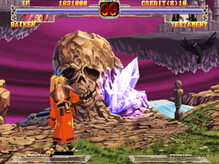 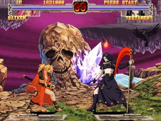 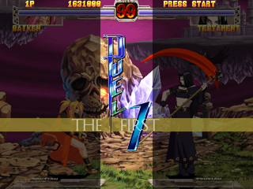 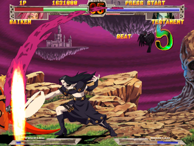

#### kofnw (Atomiswave) — VEL 98.9 / 54.2 fps
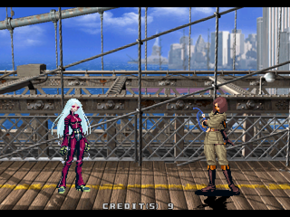 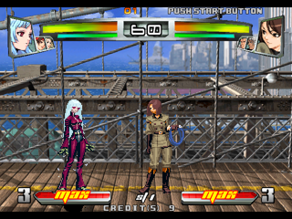 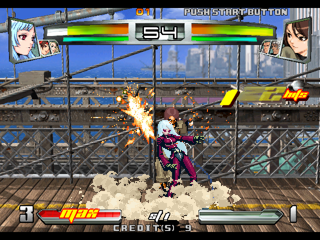 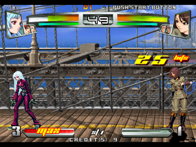

#### kofxi (Atomiswave) — VEL 100.0 / 58.6 fps
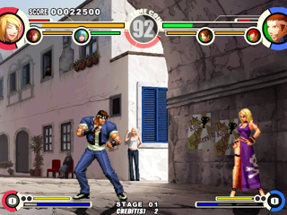 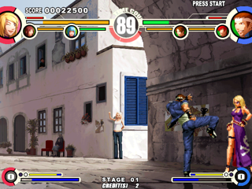 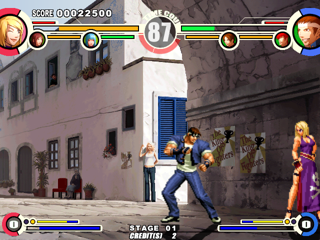 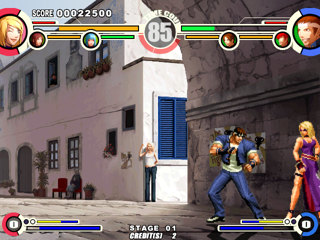

#### mslug6 (Atomiswave) — VEL 82.8 / 21.9 fps
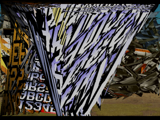 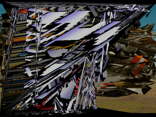 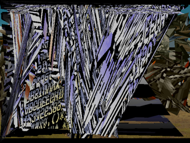 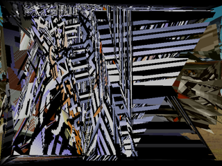

#### ngbc (Atomiswave) — VEL 100.0 / 54.9 fps
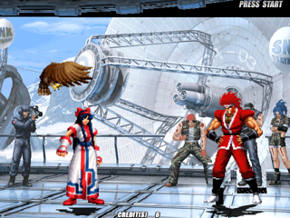 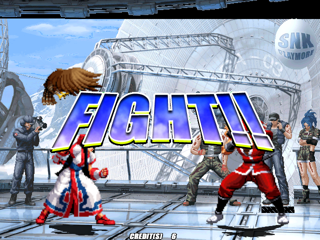 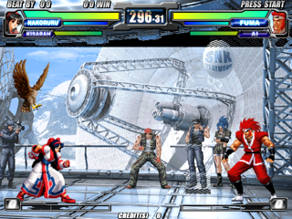 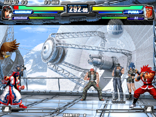

#### samsptk (Atomiswave) — VEL 100.0 / 42.6 fps
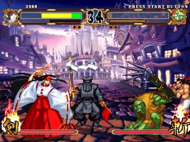 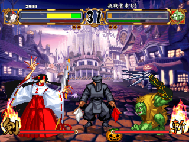 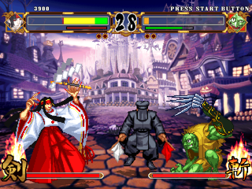 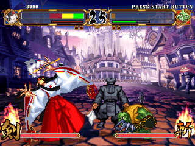

#### ggxx (Naomi) — sem imagens (crash)

#### ggxxsla (Naomi) — sem imagens (crash)

#### gwing2 (Naomi) — VEL 96.3 / 56.2 fps
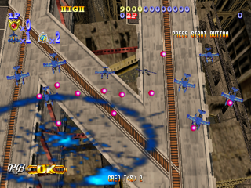 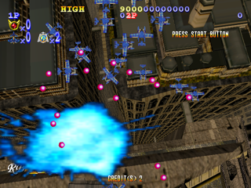 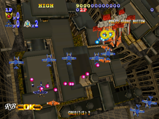 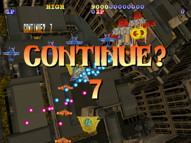

#### mbaa (Naomi) — VEL 100.0 / 59.8 fps
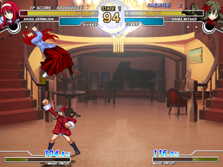 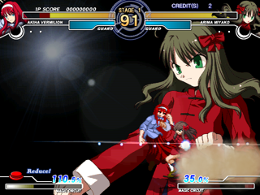 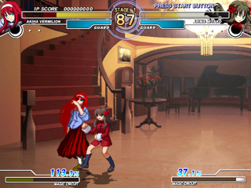 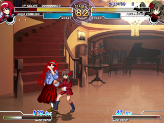

#### meltybld (Naomi) — VEL 92.3 / 54.3 fps
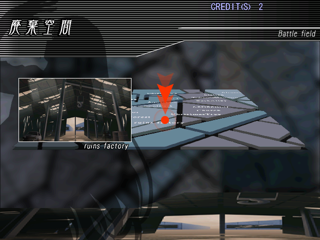 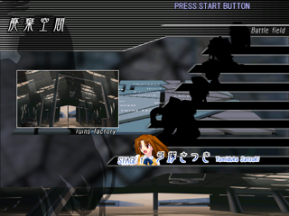 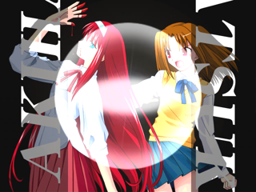 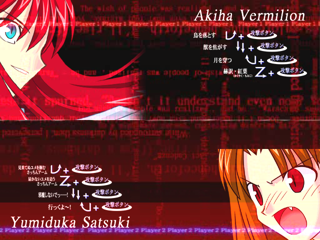

#### sfz3ugd (Naomi) — VEL 100.0 / 59.7 fps
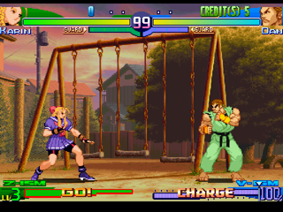 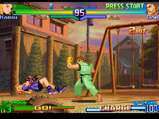 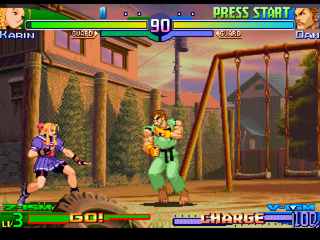 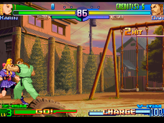

#### slashout (Naomi) — VEL 100.0 / 37.9 fps
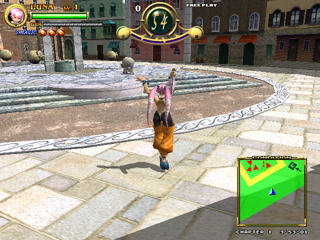 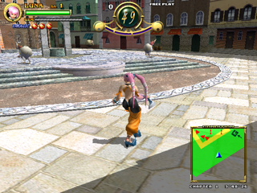 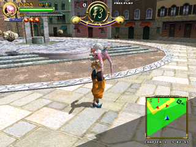 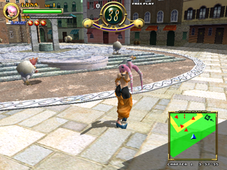

#### zombrvn (Naomi) — VEL 100.1 / 43.4 fps
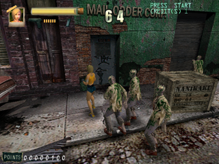 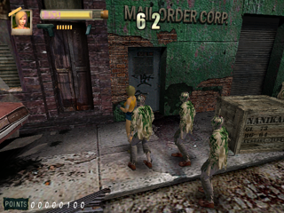 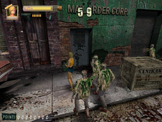 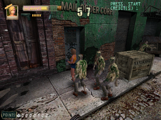

#### Soulcalibur (Dreamcast) — VEL 100.0 / 59.7 fps
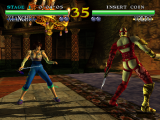 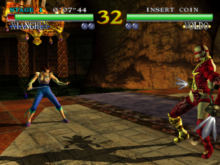  

#### Project Justice (Dreamcast) — VEL 100.0 / 59.6 fps
   

#### KOF Evolution (Dreamcast) — VEL 100.0 / 57.7 fps
   

#### Sonic Adventure 2 (Dreamcast) — 1 imagem(ns)

#### DOA2 (Dreamcast) — VEL 99.4 / 35.8 fps
   

#### Grandia II (Dreamcast) — VEL 100.0 / 30.0 fps
   

#### Napple Tale (Dreamcast) — VEL 100.0 / 30.0 fps
   

#### Phantasy Star Online 2 (Dreamcast) — VEL 99.9 / 9.9 fps
   

#### Skies of Arcadia (Dreamcast) — VEL 100.0 / 18.3 fps
 

#### Shenmue (Dreamcast) — VEL 91.9 / 27.5 fps
   

#### Shenmue II (Dreamcast) — VEL 64.4 / 19.3 fps
   

#### Le Mans (Dreamcast) — VEL 52.0 / 15.6 fps
  

#### Sonic Shuffle (Dreamcast) — VEL 100.0 / 15.7 fps
   

## Bateria de 15 jogos — 2026-09-27, `flycast_test.so` (tier2 self-heal + no-wait + wait-curto)

Build com: tier2 self-heal (4.86), modelo no-wait + `re.Wait` curto
(`g_emuWaitRe`), AICA→futex, `FC_TEX_SKIP_UNCHANGED` default ON. Morton da
textura **desligado** (`FC_TEX_GPU_MORTON` default off). `perfmax performance`,
savestate automático, **12 s + 3 s de warmup**, 1 rodada por jogo.
**15/15 com JSON, ZERO crash.** VEL% = `audio_frames / (duração × sample_rate)`.
Tempos em ms.

| jogo | sistema | VEL% | fps | média | p50 | p95 | p99 | und | dup |
|---|---|---|---|---|---|---|---|---|---|
| DOA2 | Dreamcast | 93.6 | 29.8 | 17.9 | 18.2 | 22.6 | 31.4 | 19 | 14 |
| Grandia II | Dreamcast | 100.0 | 60.0 | 3.1 | 0.3 | 8.3 | 8.7 | 1 | 407 |
| KOF Evolution | Dreamcast | 100.0 | 38.1 | 11.4 | 12.8 | 13.7 | 15.6 | 2 | 55 |
| Le Mans | Dreamcast | 98.1 | 32.7 | 16.4 | 17.1 | 21.8 | 27.7 | 7 | 40 |
| **MvC2** | Dreamcast | 100.0 | 53.0 | 6.4 | 8.1 | 11.0 | 14.4 | 0 | 186 |
| Napple Tale | Dreamcast | 99.7 | 59.4 | 4.2 | 5.1 | 8.4 | 10.2 | 3 | 355 |
| PSO v2 | Dreamcast | 70.1 | 59.9 | 1.7 | 0.3 | 12.5 | 12.7 | 73 | 613 |
| Shenmue II | Dreamcast | 66.9 | 20.8 | 27.9 | 28.8 | 30.2 | 31.7 | 78 | 9 |
| Shenmue | Dreamcast | 86.9 | 39.2 | 9.1 | 13.1 | 14.5 | 15.4 | 35 | 158 |
| Soulcalibur | Dreamcast | 100.5 | 59.0 | 6.1 | 7.8 | 9.0 | 16.7 | 3 | 215 |
| kofxi | Atomiswave | 99.9 | 59.9 | 3.4 | 4.5 | 7.1 | 8.2 | 2 | 261 |
| mslug6 | Atomiswave | 69.1 | 23.9 | 32.9 | 37.6 | 42.2 | 46.4 | 80 | 38 |
| samsptk | Atomiswave | 100.0 | 58.2 | 5.6 | 8.8 | 9.9 | 10.7 | 2 | 258 |
| mbaa | Naomi | 100.0 | 59.9 | 1.8 | 2.3 | 3.8 | 5.5 | 2 | 254 |
| **CvS2** | Dreamcast | 100.0 | 56.1 | 5.6 | 7.0 | 8.9 | 13.5 | 1 | 205 |

**Leitura:**
- **MvC2 e CvS2 descrascharam** e rodam a **VEL 100%** com cauda baixa
  (`p99` 14,4 / 13,5ms — antes o hicup era 100ms).
- **Cauda p99 baixa em todos** (≤~17ms, exceto os emu-bound: DOA2 31, mslug6 46).
- **Dupes altos** (Grandia 407/720, PSO 613/720) = o custo do no-wait (a main
  repete o último frame); a VEL fica 100% onde a emu aguenta.
- **Emu-bound (VEL < 100%):** Shenmue II 66,9% / Shenmue 86,9 / DOA2 93,6 /
  mslug6 69,1 / PSO 70,1 — o teto é o SH4/emulação, não o render.
- **PSO v2:** antes travava em ~9,9 fps; agora 59,9 fps (VEL 70%, muitos dupes) —
  melhorou, mas o 70% de VEL sugere limite emu-side. Rever depois.

## Bateria Naomi — 2026-09-28, COLD BOOT (sem savestate)

Política nova (pedido do usuário): **cold boot** (não usar `retrorun_auto_load`),
**30 s + 5 s de warmup**, 1 rodada por jogo, core `flycast2026` =
`efbe5529e1b0d7abaced0078ee418b11` (wait-curto). **Captura de 6 frames por jogo**
(`FC_FB_DUMP`) para inspeção visual — sem isso alguns números enganam. 20 ROMs de
`/roms2/naomi/*.zip`, todos com o jogo em cold boot.

**Resultado: 20/20 com JSON, ZERO erro/crash.** Vários ficam na tela de boot do
Naomi (logo NAOMI) → `~0,27 ms/frame` (60 fps), que é boot parado, não crash.

| jogo | fps | VEL% | avg ms | p95 | p99 | frames |
|---|---|---|---|---|---|---|
| asndynmt | 59,5 | 64,8 | 0,65 | 1,33 | 1,43 | 1786 |
| azumanga | 60,0 | 100,0 | 0,27 | 0,33 | 0,43 | 1801 |
| capsnk | 58,8 | 93,4 | 1,42 | 1,77 | 2,24 | 1764 |
| cspike | 60,0 | 100,0 | 0,30 | 0,33 | 0,57 | 1801 |
| cvs2 | 58,5 | 96,2 | 1,68 | 2,45 | 2,69 | 1754 |
| cvsgd | 59,2 | 99,8 | 1,56 | 2,03 | 2,58 | 1776 |
| ggisuka | 58,6 | 95,6 | 1,74 | 2,06 | 9,43 | 1759 |
| ggxxac | 60,0 | 100,0 | 0,27 | 0,32 | 0,37 | 1801 |
| ggxxsla | 60,0 | 100,0 | 0,28 | 0,35 | 0,48 | 1801 |
| ggxx | 60,0 | 100,0 | 0,26 | 0,30 | 0,32 | 1801 |
| ggx | 60,0 | 99,9 | 0,28 | 0,33 | 0,45 | 1801 |
| gwing2 | 59,1 | 90,4 | 1,24 | 1,61 | 1,69 | 1775 |
| ikaruga | 59,5 | 45,8 | 0,60 | 1,40 | 1,56 | 1787 |
| mbaa | 60,0 | 100,0 | 0,27 | 0,32 | 0,42 | 1801 |
| meltybld | 60,0 | 100,0 | 0,26 | 0,28 | 0,30 | 1801 |
| meltyb | 60,0 | 100,0 | 0,27 | 0,33 | 0,47 | 1801 |
| sfz3ugd | 60,0 | 100,0 | 0,28 | 0,32 | 0,33 | 1801 |
| slashout | 60,0 | 100,0 | 0,28 | 0,34 | 0,51 | 1801 |
| spawn | 60,0 | 100,0 | 0,27 | 0,31 | 0,33 | 1801 |
| zombrvn | 60,0 | 100,0 | 0,27 | 0,35 | 0,41 | 1801 |

**Nota de método:** a rodada anterior (mesma política, sem captura de frames, 20 s)
deu `capsnk`, `cspike`, `cvsgd` com `exit=1` / `core_frames=0` — parecia "não
boota", mas era **intermitente/inconclusivo**. Com 30 s + captura de frames, os 20
bootam (frames mostram a logo NAOMI). Lição: **cold boot precisa de mais tempo de
warmup e de captura visual** — o JSON sozinho engana.

### Inspeção visual um-a-um (cold boot) — 2026-09-28 (usuário, na tela)

O JSON/frames **não bastam**: quase tudo "boota" no JSON (tela NAOMI parada a
0,27ms/frame), mas o usuário viu na tela que vários nunca entram no jogo. Rodada
um-a-um (abre o jogo, usuário observa e fecha, pergunta sim/não), core
`flycast2026` = `efbe5529e1b0d7abaced0078ee418b11` (wait-curto), `r_noload.cfg`
(cold boot).

| jogo | resultado visual |
|---|---|
| asndynmt | **bootou** (gatilho = handover BIOS→jogo, 4.92) — com tier2 ligado; triângulo laranja + listras/prateados parked |
| azumanga | passou a logo NAOMI e **congelou em tela preta** a 61 fps |
| capsnk | bootou |
| cspike | bootou — VEL 100%, 57 fps, sem hicup/underrun |
| cvs2 | **bootou** (após fix do lazy loading; antes travava/lentidão) — 60 fps cravados, mas **menor suavidade** |
| cvsgd | boota, mas o usuário **não tem o GD** |
| ggisuka | bootou — é **Atomiswave** (mover pra pasta atomiswave) |
| ggx | bootou, mas **freeze na tela de parental advisory** a 61 fps (savestate criado) |
| ggxx | bootou, mas **freeze em tela preta** logo depois, 61 fps |
| ggxxac | bootou — demora muito pra iniciar; 60 fps no contador mas **hicups/underruns** |
| ggxxsla | boota, mas **crasha na tela de disclaimer de região** |
| gwing2 | **não bootou** |
| ikaruga | **não boota** — **bug do retrorun** (inicia "deitado" e sem controles); versão DC pendente |
| mbaa | boota, 60 fps constante, mas **perdeu suavidade com o wait curto** (cache?) |
| meltyb | **demora muito para iniciar e não boota** |
| meltybld | boota, 60 fps, **suavidade máxima** — referência pra revisar o mbaa |
| sfz3ugd | **demora muito para iniciar e não boota** |
| slashout | boota (savestate criado pra avaliar performance) |
| spawn | bootou |
| zombrvn | **não boota** |

**Categorias (ordem de ataque pedida pelo usuário):**
1. **Carts que não bootavam — corrigido (4.88/4.92):** `asndynmt`, `gwing2`,
   `zombrvn` — o gatilho do tier2 agora é o **handover BIOS→jogo** (primeiro bloco
   em `0x0C020000+`); o gatilho antigo (`0x1B16`/1º render) quebrava o cold boot.
   `asndynmt` boota com tier2; triângulo laranja/listras parked (4.93 revertido).
2. **GD-ROM:** `cvs2` bootou (lazy loading, 4.89); `meltyb`/`sfz3ugd` **pendente
   de re-validar** com o lazy loading (o boot de 22-60 s era a leitura do ROM.BIN).
   (`ikaruga` = bug do retrorun, fora; `cvsgd` = falta o GD, fora.)
3. **Bootam mas dão freeze/crash:** `azumanga`, `ggx`, `ggxx`, `ggxxsla` — 4.90.
4. **Bootam, anotação de performance (rever; `mbaa` primeiro):** `mbaa`,
   `cvs2` (60 fps cravados, **menor suavidade** — mesmo padrão do mbaa),
   `meltybld` (referência), `ggxxac`, `slashout`; `cspike`/`capsnk`/`ggisuka`/
   `spawn` limpos.

**Achados de boot (2026-09-28):**
- **`asndynmt` (cart)**: o "gira pra sempre em **152 blocos de boot**" era
  **artefato do cap de 2M linhas do `FC_JIT_TRACE`**. O que prendia era o **tier2
  ligado durante o boot**. O trace (`FC_JIT_TRACE_BOOT`+`FC_JIT_TRACE_FIRST`)
  mostrou o **handover**: `AC001E16` → `0C000620` → **`0C020000`** (código do
  jogo). O gatilho do tier2 passou a ser esse handover (primeiro bloco em
  `0x0C020000+`) — **bootou até a atração/jogo**. Triângulo laranja + listras
  prateadas: parked (o fix do laranja, 4.93, foi revertido junto com a mudança de
  exceção de FPU do decode).
- **`cvs2` (GD-ROM)**: **chega ao jogo**, mas depois de **~60 s** descomprimindo o
  CHD (`/roms2/naomi/cvs2/gdl-0007a.chd`+`gdl-0008.chd`; ~65k setores lidos,
  87,4% de hit). O "não boota" pode ser só a espera longa. Verificar o mesmo nos
  outros GD-ROM (`meltyb`, `sfz3ugd`).
- **Games têm diretórios com `.chd`** (`/roms2/naomi/<jogo>/gdl-*.chd`) para os
  títulos GD-ROM; os cartuchos usam o `.zip` MAME (chips `315-*`).

## Bateria Naomi cold boot — 2026-09-28 (pós-handover, em andamento)

Core `flycast2026` = `4c46a0cae79a7e85e1fd5a6eb01abd07` (gatilho do tier2 = handover
BIOS→jogo; cold boot `r_noload.cfg`, sem `FC_TIER2_DELAY_MS`), `--benchmark 40
--benchmark-warmup 5`. Números + impressão do usuário na tela.

| jogo | fps | VEL% | core avg | p50 | p95 | p99 | und | obs (usuário) |
|---|---|---|---|---|---|---|---|---|
| asndynmt | 59,9 | 72,8 | 0,400 | 0,27 | 1,18 | 1,23 | 6 | bootou; **tem glitch, mas passa**; não deu pra entrar no gameplay (ficou na atração) |

## Bateria Naomi cold boot — 2026-09-28 (TIER2 OFF, em andamento)

Core `flycast2026` = `4c46a0cae79a7e85e1fd5a6eb01abd07` com `r_t2off.cfg`
(`flycast2026_tier2 = disabled`), cold boot, `--benchmark 40 --benchmark-warmup 5`.
Objetivo: medir se o tier2 vale a pena (comparar com a bateria tier2 ON).

| jogo | fps | VEL% | core avg | p50 | p95 | p99 | und | obs (usuário) |
|---|---|---|---|---|---|---|---|---|
| asndynmt | 57,6 | 60,7 | 1,521 | 0,34 | 4,69 | 7,86 | 50 | velocidade **lisa** até o character select, **crashou depois de selecionar o personagem** (tech debit) |
| azumanga | 59,7 | 96,1 | 1,303 | 1,32 | 1,61 | 2,45 | 0 | **jogo perfeito** — era um dos piores casos no upstream (com tier2 ligado trava em tela preta) |
| capsnk | 57,9 | 93,8 | 1,985 | 1,12 | 5,23 | 14,79 | 0 | **perfeito**; rever cache de paletas + wait-curto p/ suavizar movimentação |
| cspike | 51,8 | 95,5 | 4,352 | 1,24 | 16,07 | 19,10 | 0 | **completamente jogável**; com tier2 dava 60 fps mas o tier2 **destruía a iluminação** |
| cvs2 | 59,3 | 93,3 | 1,451 | 1,13 | 3,12 | 4,70 | 0 | **perfeito**; só a suavização (cache + wait) |
| ggisuka | 59,3 | 95,0 | 2,721 | 1,25 | 9,30 | 14,94 | 0 | **perfeito** (é Atomiswave — movido pra `/roms2/atomiswave/`) |
| ggxxac | 59,8 | 92,1 | 1,359 | 1,18 | 2,25 | 3,04 | 0 | **100%**, liso; com tier2 o tier2 estava **destruindo** (mais um) |
| ggxxsla | 59,7 | 92,1 | 1,415 | 1,31 | 2,28 | 2,88 | 0 | **perfeito** (com tier2 crashava no disclaimer de região) |
| ggxx | 59,7 | 92,3 | 1,870 | 1,43 | 3,71 | 10,27 | 0 | **perfeito** |
| ggx | 59,1 | 94,4 | 2,766 | 0,34 | 11,16 | 17,38 | 0 | **perfeito** (com tier2 travava na tela de parental advisory) |
| gwing2 | 59,6 | 92,2 | 1,268 | 1,20 | 3,38 | 4,01 | 0 | jogável; slowdown com **tiros massivos** na tela (não perde jogabilidade); depois dos 40s do bench chegou a **45 fps** (o bench não pegou a cena pesada) |
| ikaruga | 51,9 | 93,7 | 4,806 | 1,60 | 14,22 | 27,63 | 0 | gráficos/jogabilidade decentes; **controles invertidos + aspect ratio errado** (formato arcade) |
| mbaa | 59,7 | 80,1 | 1,126 | 1,16 | 1,97 | 2,58 | 0 | **perfeito** (VEL 80% mas a percepção é 100% — métrica conservadora) |
| meltybld | 59,6 | 94,0 | 1,766 | 1,31 | 3,15 | 6,42 | 0 | **perfeito**; underruns só nas transições entre batalhas (reduziu ~80%); **barras de life ainda não exibem direito** |
| meltyb | 58,2 | 94,8 | 3,155 | 1,21 | 13,62 | 15,65 | 0 | tela preta → transição de batalha (antes hiccups extremos, **agora 0**), mas **trava (tela preta) quando a luta vai começar** — tech debit (tier2 OFF) |
| sfz3ugd | 59,6 | 95,0 | 1,680 | 1,30 | 4,33 | 5,73 | 0 | **perfeito** (com tier2 demorava muito e não bootava) |
| slashout | 59,2 | 91,4 | 1,235 | 0,36 | 2,72 | 3,94 | 0 | jogável; cauda mais fixa, **fps fica em 27-32** (o bench de 40s não pegou a cena) — tech debit do benchmark curto |
| spawn | 57,9 | 87,8 | 2,224 | 1,21 | 6,31 | 11,73 | 0 | jogável; **controlabilidade pouco responsiva** |
| zombrvn | 53,7 | 96,8 | 5,181 | 1,52 | 15,24 | 18,33 | 0 | jogável; 40-55 fps no gameplay (como spawn), mas **sensação de jogabilidade boa** (com tier2 não bootava) |

### Resumo da bateria tier2 OFF (2026-09-28)

**19/20 testados** (`cvsgd` pulado: sem o GD). Core `4c46a0ca` + `r_t2off.cfg`.
Com `RETRORUN_BENCHMARK_KEEP_RUNNING=1` (o jogo não fecha no fim da janela).

- **Jogáveis/perfeitos: 17 de 19.** `asndynmt` e `meltyb` têm bug com tier2 OFF
  (crash no character select — 4.94; hang quando a luta começa — 4.95).
- **Contra a bateria tier2 ON:** com o tier2 ligado, **quase todos** esses jogos
  quebravam — tela preta (`asndynmt`, `azumanga`, `ggxx`), freeze em tela de
  aviso (`ggx`), crash no disclaimer (`ggxxsla`), **iluminação destruída**
  (`cspike`), não boota (`meltyb`, `sfz3ugd`, `gwing2`, `zombrvn`), etc.
- **Conclusão:** no **Naomi**, o tier2 é **perda líquida** — ele quebra muito mais
  do que ajuda. A hipótese do usuário ("ver no que esse cara que é tão caro vale
  a pena") se confirmou: **não vale para Naomi**. (O tier2 foi feito para os 3D
  do Dreamcast: DOA2/Shenmue II.)
- **Ainda a revisar (percepção, não tier2):** suavização de movimentação
  (`capsnk`, `cvs2`) — cache de paletas + wait-curto.

### Napple Tale (DC) — savestate do usuário a 75% de velocidade (2026-10-01)

Usuário (jogando, pelo ES): quando o jogo fica lento o contador vai a **340+ fps**
e o **som desafina**. Medido no savestate (ambiente do ES, sem instrumentação):
VEL **74,8%**, **22,4 frames novos/s** (o jogo pede 30), 384 `retro_run`/s (quase
todos duplicados, isso é o "340 fps"), áudio esticado em média 1,33x pelo retrorun
(o "desafinado"), 6 underruns. Ver `docs/tech_debits.md` 4.97.

| Rodada | VEL% | fps real (novos) | retro_run/s | core avg/p50/p95/p99 (ms) | active p50/p95/p99 (ms) | underruns |
|---|---|---|---|---|---|---|
| A limpa | 74,8 | 22,4 | 384 | 1,70 / 0,33 / 22,9 / 24,4 | 1,17 / 24,1 / 25,7 | 6 |
| B dump JIT | 23,8 | 7,1 | 662 | 0,71 / 0,30 / 0,41 / 22,6 | 1,03 / 1,56 / 23,7 | 61 |

(p50/média de frame time não valem aqui: as voltas com frame duplicado dominam.)
