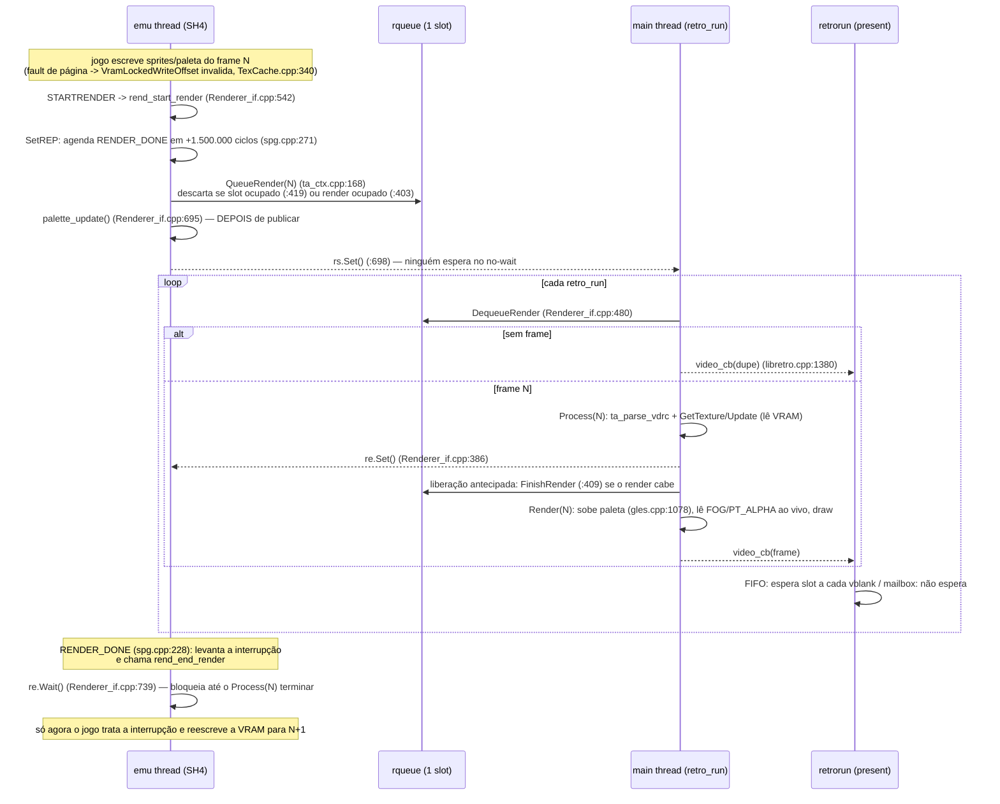

# Sincronização emu ↔ render: `rs`/`re`, no-wait, wait curto, wait por página e invalidação de textura/paleta

> Documento de referência (2026-10-02, branch `t2_tests`, HEAD `28b4dbdbd`).
> Explica de ponta a ponta o mecanismo que liga a thread de emulação à thread
> de render (main) neste fork, por que existe uma corrida na VRAM, por que cada
> espera foi colocada, o que o upstream faz de diferente e uma proposta de
> arquitetura para eliminar a corrida sem quebrar as paletas.
>
> Convenções: `arquivo:linha` se refere ao código no HEAD acima. Números de
> desempenho vêm sempre de um doc citado (item do `tech_debits.md` ou data do
> `history.md`). O que for **inferência** (dedução do código, não medida)
> está marcado assim. Nenhum código foi alterado para escrever este documento.

---

## 0. Resumo em 12 linhas

> **Plano revisado em 2026-10-02 com dados novos do usuário: ver seção 9** (o 2D-só do glitch, a biblioteca Naomi 100% jogável como linha de base, Morton no shader como prioridade).

1. A espera que **protege a VRAM** é o `re.Wait()` da thread de emulação no
   fim do render emulado (`Renderer_if.cpp:736-739`, chamado pela interrupção
   RENDER_DONE em `spg.cpp:237`). O `rs.Wait(100)` é da **main thread**
   (`Renderer_if.cpp:467`) e só serve para cadenciar a main thread: não protege
   nada na VRAM.
2. O modelo no-wait (2026-09-27 14:20) desligou **as três** esperas de uma vez
   com a mesma chave (`g_emuNeverWaits`): `rs.Wait` (main), `frame_finished.Wait`
   (emu, na fila) e `re.Wait` (emu, no RENDER_DONE). O ganho da cauda veio do
   primeiro; o glitch de sprite veio do terceiro.
3. **Estado real do código hoje:** o wait curto (`re.Wait` até o fim do `Process`) está
   **ligado** (`g_emuWaitRe = 1`, `ta_ctx.cpp:62`). O wait por página (4.87)
   **não existe mais no código**: foi tirado, junto com a volta do
   `g_emuWaitRe = 1`, pelo commit `ea0414f3c` (2026-09-28, mensagem "docs:
   bateria Naomi cold boot"), sem registro nos docs. O `tech_debits.md` 4.87
   e o `history.md` de 2026-09-27 22:05 ainda dizem "RESOLVIDO / default 0".
4. `FC_TEX_GPU_MORTON` está **desligado** por padrão (`TexCache.h:715`). E mesmo
   ligado, o código atual **continua fazendo o untwiddle na CPU** dentro do
   `Process` (`TexCache.cpp:983`) e só depois sobe os bytes crus
   (`gltex.cpp:66-100`): o Morton na GPU, do jeito que está, não encurta o
   `Process` e portanto não encurta o wait curto. A relação causal que o usuário
   descreve (Process menor → wait curto menor) está certa; a implementação é que
   ainda não entrega isso. O "~16×" não aparece em nenhum doc.
5. A paleta na GPU (4.12 de 2026-09-16 e 4.15 de 2026-09-22) é outra coisa, e essa sim
   encurtou o `Process` (mslug6: tempo de textura 42,5 → 20,6 ms/frame;
   samsptk: `core_average` 48,9 → 12,1 ms). Ela veio antes do no-wait e é
   parte do motivo de o wait curto ser barato nos jogos 2D.
6. A corrida: o fim de render emulado (RENDER_DONE) é agendado a tempo fixo
   (1.500.000 ciclos, `spg.cpp:271`) e não depende de a main thread ter lido as
   texturas. Sem o `re.Wait`, o jogo recebe "render pronto" e reescreve os
   sprites do frame N+1 enquanto o `Process` do frame N ainda nem leu (ou está
   lendo) a VRAM.
7. Há uma segunda corrida, independente do wait: a textura é **lida antes de ser
   protegida** (`TexCache.cpp:983` lê, `:1034` protege). Uma escrita do jogo
   nesse intervalo se perde e a textura fica velha até a próxima escrita.
   O wait por página (4.87) tapava só parte disso.
8. A paleta tem três problemas próprios no modelo no-wait: o `palette_update`
   roda depois de o frame já estar publicado na fila (`ta_ctx.cpp:436` antes de
   `Renderer_if.cpp:695`); a textura de paleta é subida no `Render`, depois de
   `re.Set()` (`gles.cpp:1078-1081`); e a flag `palette_updated` pode perder uma
   atualização (inferência, seção 3.4). O `g_palMutex` só evita leitura rasgada.
9. A perda de suavidade (MBAA/cvs2) é melhor explicada pelo **padrão de
   entrega de frames** do que por "atraso na invalidação": a invalidação é
   síncrona, no fault da escrita. Dos números do próprio doc: MBAA a VEL 100%
   e 59,9 "fps" com 254 duplicados em 12 s ≈ **39 frames novos/s** de um jogo
   de 60 (bateria 2026-09-27). Antes do no-wait a fila esperava o render
   quando ele cabia (4.16) e não descartava.
10. O giro do Napple (4.97) é o mesmo mecanismo visto pelo outro lado: sem
    `rs.Wait`, a main thread não espera frame; em mailbox nada cadencia o
    `retro_run` (384 voltas/s, ~96% de um core).
11. O upstream **não** tem modelo no-wait: espera no RENDER_DONE
    (`renderEnd.Wait`), espera na fila se o SH4 acompanha, e a main thread
    espera frame com timeout de 20 ms. A textura de paleta sobe no `Process`
    (antes do `renderEnd.Set`). A mesma leitura-antes-de-proteger existe lá,
    escondida pelas esperas.
12. Recomendação: medir primeiro (seção 7); depois, em ordem: paleta e registradores
    do PVR por frame dentro do `rend_context`, proteger a textura antes de lê-la,
    espera com prazo na main thread, separar as três esperas, encurtar o `re.Wait`
    até a última leitura de VRAM (e consertar o Morton), e por fim
    cópia-na-escrita (COW) de página de VRAM por época, que elimina o `re.Wait` nos
    frames que não são RTT.

---

## 1. Mapa do mecanismo hoje

### 1.1 Threads

| Thread | Quem cria | O que faz | Quem a cadencia |
|---|---|---|---|
| **emu** | `emu_thread_func` (`libretro.cpp:240-266`), iniciada no 1º `retro_run` (`libretro.cpp:1356`) | SH4 + JIT + scheduler; monta o contexto do TA (`TA_context`); escreve VRAM e paleta; chama `rend_start_render` (STARTRENDER, `pvr_regs.cpp:28-31`) e `rend_end_render` (RENDER_DONE, `spg.cpp:228-240`) | o áudio: o push de amostras bloqueia quando a fila do frontend enche (`audiostream.cpp:47-48`; "o loop fica regulado pelo backpressure do áudio", 4.18) |
| **main / render** | thread do frontend que chama `retro_run` | `rend_single_frame` (`libretro.cpp:1366`): `Process` (parse do TA + conversão/upload de textura) e `Render` (submissão GL), depois `video_cb` (`libretro.cpp:1380`) | o frontend: com vsync+FIFO o `present` espera um slot a cada vblank; em mailbox nada espera (seção 4) |
| **apresentação (retrorun)** | `present_worker_thread` (`retrorun/src/platform/platform_sdl.cpp:1643`) | dona da janela; faz o `SDL_GL_SwapWindow`/flip | o vsync |
| **AICA render, CHD** | helpers parkeados (`docs/thread_separation_plan.md` §2) | não participam desta sincronização | — |

### 1.2 Dados compartilhados

| Dado | Escreve | Lê | Proteção hoje |
|---|---|---|---|
| `TA_context` (geometria, `tsp`/`tcw` das texturas, alguns registradores copiados) | emu (`ta_vtx`, `rend_start_render` `Renderer_if.cpp:674-682`) | main (`ta_parse_vdrc`, `ta_vtx.cpp:1596`) | posse única: sai da emu ao entrar na fila (`ta_ctx.cpp:433-437`); `rend_inuse` (`gles.cpp:1444`) |
| fila `rqueue` (**1 slot**) | emu (`QueueRender`, `ta_ctx.cpp:168-442`) | main (`DequeueRender`, `ta_ctx.cpp:444-454`); liberada por `FinishRender` (`ta_ctx.cpp:465-477`) | `mtx_rqueue` |
| **VRAM** (bytes das texturas) | emu: escritas do SH4/DMA/SQ (todas passam pelo espelho protegido: `vram.data` aponta para ele, `_vmem.cpp:505/556`) | main: `Update()` lê `&vram[sa]` ao converter (`TexCache.cpp:983` e vizinhas) | **nenhuma sincronização de dados**; só o `re.Wait` ordena (seção 3) |
| proteção de página / lista `VramLocks` | emu (fault → `VramLockedWriteOffset`, `TexCache.cpp:340-392`); main (`libCore_vramlock_Lock`, `:301-336`) | ambos | `vramlist_lock` |
| `dirty`/`lock_block` de cada textura | emu (`rend_text_invl`, `TexCache.cpp:1257-1263`) e main (`Update`, `:732`) | main (`NeedsUpdate`, `:573-611`) | não atômico (inferência: corrida benigna, se resolve no próximo frame) |
| `PALETTE_RAM` (registradores do PVR) | emu (`pvr_regs.cpp:114-117` marca `pal_needs_update`) | emu (`palette_update`) | — |
| `palette16_ram`/`palette32_ram`, `pal_hash_16/256` | emu (`palette_update`, `TexCache.cpp:211-247`) | main (`NeedsUpdate` `:598-601`; conversão paletizada na CPU; `UpdatePaletteTexture` `gles.cpp:940-965`) | `g_palMutex` só no `palette_update` e no `glTexImage2D` da paleta (`gles.cpp:957-958`); hashes e conversão na CPU sem mutex |
| flag `palette_updated` | emu (`TexCache.cpp:217`) | main lê e zera (`gles.cpp:1078-1081`) | nenhuma |
| outros registradores do PVR (`FOG_*`, `PT_ALPHA_REF`, `FB_W_*`, `FB_X_CLIP`, `TEXT_CONTROL`, `PAL_RAM_CTRL`) | emu | main, **ao vivo**, no `Render` (`gles.cpp:1046-1057`, `:1076`, `:1089`, `:1143`) e no `Update` | nenhuma (só `FB_X/Y_CLIP` e fog clamp são copiados para o ctx, `Renderer_if.cpp:678-682`) |

### 1.3 Sinais

Todos são `cResetEvent` com auto-reset: `Set` deixa o estado ligado até um
`Wait` consumir; `Wait(ms)` devolve falso no timeout (`libretro/common.cpp:620-666`).

| Sinal | `Set` por | `Wait` por | Significado |
|---|---|---|---|
| `rs` (`Renderer_if.cpp:84`) | emu: frame enfileirado (`:698`), troca de framebuffer (`:837`), cancelamento (`:758`) | main: `rs.Wait(100)` (`:467`), **só se `!g_emuNeverWaits`** (`:464`) | "tem frame (ou swap) pra você" |
| `re` (`Renderer_if.cpp:85`) | main: logo após o `Process` (`:384-386`); para RTT só depois do `Render` (`:505-506`); cancelamento (`:759`) | emu: `re.Wait()` no RENDER_DONE (`:739`), se `!g_emuNeverWaits \|\| g_emuWaitRe` (`:736`) | "já li as texturas do frame que você mandou" |
| `frame_finished` (`ta_ctx.cpp:166`) | main: `FinishRender` (`ta_ctx.cpp:476`), inclusive na liberação antecipada (`Renderer_if.cpp:409`) | emu: `QueueRender` (`ta_ctx.cpp:385`), só se `!g_emuNeverWaits` e (`SH4FastEnough` e o render cabe) (`:381-382`); e `SynchronousRendering` (`:299`, opção desligada por padrão) | "o slot da fila ficou livre" |

Chaves (variáveis de ambiente lidas uma vez):

| Variável | Padrão no código | Onde |
|---|---|---|
| `g_emuNeverWaits` (`FC_EMU_WAIT=1` desliga) | **1** (no-wait ligado) | `ta_ctx.cpp:56`, leitura `:373-380` |
| `g_emuWaitRe` (`FC_EMU_WAIT_RE`) | **1** (wait curto ligado) | `ta_ctx.cpp:62`, leitura `Renderer_if.cpp:727-733` |
| liberação antecipada (`FC_NO_EARLY_RELEASE=1` desliga) | ligada | `Renderer_if.cpp:388-414` |
| filtro de render ocupado (`FC_EARLY_THRESHOLD_US`) | 1000 µs | `ta_ctx.cpp:390-418` |
| `FC_TEX_SKIP_UNCHANGED` | **ligado** | `TexCache.cpp:64-81` |
| `FC_TEX_GPU_MORTON` | **desligado** | `TexCache.h:712-717` |
| paleta bilinear na GPU (`FC_NO_GPU_PAL_BILINEAR=1` desliga) | ligada | `TexCache.h` (`GpuPaletteBilinearEnabled`), 4.15 |
| `FC_TEX_PRECISE_INVL` | desligado (quebra a imagem, 4.13) | `TexCache.cpp:38-62` |
| pacer (`FC_PACER`), orçamento de tempo (`FC_RENDER_BUDGET*`) | desligados | `ta_ctx.cpp:24-45` |
| teto de frameskip | 33% | `ta_ctx.cpp:64`, 4.79 |

### 1.4 O caminho de um frame, hoje (no-wait + wait curto)



O mesmo em ASCII, com os pontos de espera (`[W]`) e os de descarte (`[D]`):

```
 emu thread                                   main thread (retro_run)
 ----------                                   -----------------------
 escreve VRAM/paleta (fault invalida)
 STARTRENDER ─► rend_start_render :542
   SetREP (+1,5M ciclos) :659 / spg.cpp:271
   QueueRender :693
     [D] pacer/orçamento (off)  ta_ctx :197/:257
     [W] frame_finished.Wait    ta_ctx :385   (DESLIGADO pelo no-wait)
     [D] render ocupado > 1 ms   ta_ctx :403
     [D] slot ocupado           ta_ctx :419
     rqueue = ctx               ta_ctx :436 ───────►  DequeueRender :480
   palette_update :695 (depois de publicar!)          [W] rs.Wait(100) :467 (DESLIGADO)
   rs.Set :698                                        sem frame → dupe :487
 ... SH4 continua o frame (até 7,5 ms emulados) ...   Process :380  (lê VRAM, sobe textura)
 RENDER_DONE spg.cpp:228                              re.Set :386 ─────────┐
   [W] re.Wait :739  ◄──────────────────────────────────────────────────┘
 jogo trata RENDER_DONE, reescreve VRAM N+1           liberação antecipada :409 (FinishRender)
                                                      Render :418 (paleta, FOG, PT_ALPHA ao vivo)
                                                      video_cb → present (FIFO espera vblank)
```

Observações que importam para o resto do documento:

- O `re.Wait` fica no ponto **semanticamente certo**: o RENDER_DONE emulado é o
  aviso que o jogo usa para saber que o PowerVR terminou de ler a VRAM. No
  hardware real o jogo não reescreve textura em uso antes disso. O comentário de
  2014 no topo do arquivo já descrevia esse desenho: "wait and block for
  parse/texcache. Render is async" (`Renderer_if.cpp:68-70`), e listava o
  problema e a saída: "VRAM integrity is an issue with out-of-order or delayed
  rendering", "Texture versioning and staging" (`Renderer_if.cpp:50-52, 61-65`).
- O RENDER_DONE é agendado a **tempo emulado fixo** (`spg.cpp:271`,
  1.500.000 ciclos ≈ 7,5 ms a 200 MHz), sem relação com o progresso real da
  main thread. É isso que torna o `re.Wait` necessário.
- O `re.Set()` sai **depois do `Process` inteiro**, não depois da última
  leitura de VRAM. O `Process` também faz o parse dos vértices, que não toca
  VRAM. No Shenmue II o `Process` era ~7,76 ms, dos quais ~0,95 ms de leitura de
  VRAM (4.87, 2026-09-27).

---

## 2. Linha do tempo

| Data | Mudança (commit / item) | O que medimos |
|---|---|---|
| 2014-05-02 / 2018-08-13 | Modelo herdado do reicast: `rs.Wait(100)` na main, `re.Wait` no RENDER_DONE, fila de 1 slot que descarta (`411aade5e`/`9d438c3ff` "Improve async/mt rendering & sync logic"; `747e417cc` ThreadedRendering) | — |
| 2026-09-16 | **4.12**: `TextureUpscale` não inicializado matava o caminho de paleta na GPU; corrigido (`1f3b8a812`) | mslug6 14,4 → 19,4 fps; tempo de textura 42,5 → 20,6 ms/frame; `core_p99` 149,8 → 64,3 ms; kofnw 52,0 → 55,7 fps |
| 2026-09-16 | **4.13**: invalidação precisa por página (`FC_TEX_PRECISE_INVL`) dá +63% de fps mas embaralha sprites; hipótese de invalidação espúria refutada (2% de updates idênticos no mslug6) | registro em `texcache_vram_invalidation_plan.md` |
| 2026-09-18/19 | **4.14** idle fast-forward + **4.16**: a fila descartava 25% dos frames do kofxi; portado o `SH4FastEnough` do upstream e o critério "o render cabe no intervalo do jogo" → `frame_finished.Wait` em vez de descartar (`700a3d435`) | kofxi 49,7 → 59,2 fps, 82,9 → 100%; MBAA 50,0 → 59,9 fps, 83,3 → 100%; mslug6 25,5 fps a 98,7% (igual ao baseline) |
| 2026-09-19 | **4.18** apresentação em thread no retrorun; FIFO a ≥95% de velocidade, mailbox abaixo (`retrorun` `648f450`) | Shenmue 17,1 → 21,1 fps, 57 → 71%; kofxi FIFO 59,5 fps/100%; Shenmue mailbox 23,2 fps/77,7% |
| 2026-09-22 | **4.15** paleta bilinear na GPU (`32a2b9ed1`) | samsptk 20,0 → 59,4 fps; `core_average` 48,9 → 12,1 ms; underruns 195 → 2 |
| 2026-09-22 | **4.21**: KOF Evo, render ~21 ms > 16,7 ms; a fila de 1 slot joga fora o frame que chega durante o render | 30,4 fps a 100%; `rsWait` 10,3 ms |
| 2026-09-23 | **4.29** margem de 75% para esperar; **4.33** liberação antecipada do slot + filtro "render quase no fim" (`466e899e9`) | sem critério: KOF Evo 36-43 → 53,6 fps mas VEL 100 → 90,8%; com critério: 100%, ~37 fps; `emu_re_wait` DOA2 0,3 ms/frame, Zombie 0,13 |
| 2026-09-24 | **4.35** um upload de índices por lista (`156504699`) | KOF Evo 58,8 fps a 100% |
| 2026-09-26 | **4.79** teto de frameskip 33% (`e68bf7deb`) | Shenmue: budget 100 → 16,5 fps/95,6%/p95 100,6 ms; 33 → 26,8 fps/89,4%/p95 40,4 ms |
| 2026-09-27 13:05 | Pacer determinístico (opt-in) | negativo: MvC2 off 517 frames/p50 10,4 × div2 423/13,9 × div3 286/33,7. O `core_p99 = 100 ms` aparece em todas as configs = timeout do `rs.Wait(100)` (`frame_pacing_plan.md` §2c) |
| **2026-09-27 14:20** | **Modelo no-wait** (`0b330b7e0`): `g_emuNeverWaits = 1` desliga `rs.Wait`, `frame_finished.Wait` e `re.Wait` | MvC2: com wait 518 frames/VEL 95,2/p99 100,4/10 dup → sem 740/97,1/39,1/300 dup; CvS2 856/99,9/p99 11,2/288 dup; DOA2 472/100,0/33,2/46 dup; Shenmue 610/89,5/14,9/208 dup |
| **2026-09-27 19:45** | Morton na GPU (`FC_TEX_GPU_MORTON`, default **off**); aparece o glitch de sprite = corrida na VRAM exposta pelo no-wait; **wait curto** `g_emuWaitRe = 1`; `FC_TEX_SKIP_UNCHANGED` default on; `g_palMutex` (mesmo commit `0b330b7e0`, sem registro nos docs) | MvC2 wait curto 717/718 frames, `core_average` 7,77 ms × sem 750/727, 6,97 ms (~5%); SKIP_UNCHANGED 829/821 × 782/796, `core_average` 5,70 × 6,99 ms; Morton no MvC2 neutro |
| 2026-09-27 20:15 | Regressão do Shenmue II isolada: é o wait curto | 21,0 fps/67,5% (wait curto) × 25,9 fps/71,3% (`FC_EMU_WAIT_RE=0`) |
| 2026-09-27 22:05 | **4.87 "resolvido"**: `TexReadScope` + espera por página no fault; `g_emuWaitRe = 0` (`5bc7b8b03`) | concorrência real 0,6% (Shenmue II, 1/172) × 17% (MvC2, 473/2729); Shenmue II 21,0 → 24,7/24,0 fps; MvC2 sem glitch em 12 frames |
| 2026-09-27 22:15 | "Regressões" do kofevo/Shenmue II eram leitura de cena | kofevo 35,1/35,9 fps (p99 25,8/15,8) → 37,5/37,3 (p99 14,9/14,6) |
| **2026-09-28 09:57** | Commit `ea0414f3c` ("docs: bateria Naomi cold boot") **remove o `TexReadScope` e a espera por página e volta `g_emuWaitRe = 1`** (diff: `TexCache.cpp` −42, `ta_ctx.cpp`, `libretro.cpp` −3). Nenhum doc registra o motivo | bateria Naomi do dia com core `efbe5529` "wait-curto": `mbaa` "perdeu suavidade com o wait curto (cache?)", `cvs2` "menor suavidade", `meltybld` "suavidade máxima" (`game_status.md`) |
| 2026-10-01 | **4.97** Napple Tale: no-wait + mailbox do retrorun → `retro_run` sem ritmo | A (padrão): 22,4 novos/s, VEL 74,8%, 384 `retro_run`/s; C (`FC_EMU_WAIT=1`): 24,2 fps, 0 dup, VEL 80,9% |

### 2.1 O que o usuário lembra × o que o código e o histórico mostram

| Relato | O que o código/docs mostram |
|---|---|
| "Tirar o `rs.Wait(100)` ganhou muita performance em MvC2/KOF Evo" | Confere. O `core_p99` caiu de 100 para 11-39 ms (2026-09-27 14:20) e o kofevo foi de 35-36 para 37,5 fps com p99 menor (22:15). Só que a mesma chave também desligou as duas esperas da emu (`ta_ctx.cpp:381`, `Renderer_if.cpp:736`). |
| "A invalidação do cache demora e o `rs.Wait` escondia isso" | Quem escondia era o **`re.Wait`** (espera da emu), não o `rs.Wait` (espera da main). O fix escolhido religou exatamente o `re.Wait` (wait curto). A invalidação em si é síncrona (seção 3.2). |
| "Mudaram para um wait curto" | Confere: `g_emuWaitRe = 1`, `re.Wait` até o `Process` (`Renderer_if.cpp:734-745`). É o estado do código hoje. |
| "O Morton na GPU foi primordial, ~16× no cálculo de paletas" (correção do usuário: o Morton é o untwiddle, na thread de render, e o que importa é encurtar o `Process` que o wait curto espera) | A relação causal está certa: `re.Set()` só sai depois do `Process` (`Renderer_if.cpp:380-386`), então tudo que encurta o `Process` encurta o wait curto. Mas: (a) `FC_TEX_GPU_MORTON` está **off** por padrão (`TexCache.h:715`; a bateria de 2026-09-27 registra "Morton desligado"); (b) mesmo ligado, o `Update()` **ainda faz o untwiddle na CPU** (`texconv8`, `TexCache.cpp:983`) e o resultado é jogado fora quando `gpu_morton` é verdadeiro (`TexCache.cpp:1042` + `gltex.cpp:66-100`, que copia os bytes crus e sai). O `Process` não encolhe, cresce um pouco (memcpy + upload cru). (c) Os números registrados do Morton são: bancada na RTX 3060 8 µs (CPU) × 2,2 µs (kernel) para 64², 73× para 512², 20× pior para 8×8; no Mali +0,05 ms/frame; A/B no MvC2 neutro (2026-09-27 19:45). "16×" não aparece em nenhum doc. |
| "Paleta na GPU" (samsptk 20 → 59) | Confere (4.15). Ela encurta o `Process` de verdade e veio antes do wait curto (4.12 de 2026-09-16, 4.15 de 2026-09-22). |
| "O wait por página do 4.87 substituiu o wait curto" | **Não é o estado do código.** Foi implementado em `5bc7b8b03` e tirado em `ea0414f3c` um dia depois. Todas as impressões de jogo desde 2026-09-28 (MBAA, cvs2, capsnk) foram com o wait curto. |
| "O wait curto tirou suavidade (MBAA)" | O wait curto e o no-wait entraram **no mesmo build** (`0b330b7e0`). A bateria não separa os dois. A seção 3.5 mostra por que o descarte de frames do no-wait explica melhor a perda. |

---

## 3. A corrida, explicada com precisão

### 3.1 O protocolo que o hardware garante e o emulador não

No Dreamcast/Naomi o PowerVR lê as texturas direto da VRAM durante o render
(entre STARTRENDER e RENDER_DONE). O jogo escreve os sprites do próximo frame
**depois** do RENDER_DONE, muitas vezes no mesmo endereço (streaming de
sprites: MvC2, mslug6). Não existe cópia nem conversão.

No emulador:

1. STARTRENDER: o contexto do TA (geometria + `tsp`/`tcw`) vai para a fila
   (`ta_ctx.cpp:436`). Os **bytes** das texturas ficam na VRAM ao vivo: o
   `TA_context` não guarda conteúdo de textura.
2. A main thread lê a VRAM quando processa o frame: `ta_parse_vdrc` → `GetTexture`
   (`ta_vtx.cpp:756, 826, 842, 1224, 1622`) → `gl_GetTexture` → `NeedsUpdate`/
   `Update` (`gltex.cpp:481-485`) → conversão (`TexCache.cpp:983` e vizinhas) →
   `glTexImage2D` (o GL copia os bytes na chamada).
3. RENDER_DONE chega a tempo emulado fixo (`spg.cpp:271`), seja qual for o estado
   da main thread.

O dado compartilhado é a VRAM. A emu escreve, a main lê, e a única coisa que
ordena "main leu o frame N" antes de "jogo escreve o N+1" é o `re.Wait`.

### 3.2 Por que a invalidação "demora" (e por que ela não demora)

A invalidação é **síncrona**: a primeira escrita do SH4 numa página protegida
gera SIGSEGV, o handler chama `VramLockedWriteOffset` (`TexCache.cpp:340`) na
própria emu thread, que marca suja **toda** textura registrada na página
(`rend_text_invl`, `:1257-1263`, `dirty = FrameCount`), limpa a lista e
desprotege a página (`:380`). A escrita só termina depois disso. Não existe
invalidação pendente.

O que "demora" é o **consumo**: a textura suja só é relida quando um frame que
a usa passa pelo `Process`. Entre o STARTRENDER(N) e esse momento existem:

- a **latência de coleta**: no no-wait a main só olha a fila uma vez por
  `retro_run` (`Renderer_if.cpp:480-488`). Com FIFO+vsync isso pode ser até um
  vblank (~16,7 ms);
- o próprio `Process` (parse + conversão + upload).

O wait curto segura a emu nesse intervalo inteiro (latência de coleta +
`Process`), descontado o que a emu leva para chegar ao RENDER_DONE. O
comentário em `ta_ctx.cpp:57-61` diz "custa o `Process`, não o frame inteiro".
Isso valia no modelo antigo, em que a main estava bloqueada no `rs.Wait` e pegava
o frame na hora. No no-wait também entra a latência de coleta. **Inferência
do código**: nenhum contador hoje separa as duas parcelas (`g_emuReWaitUs`,
`Renderer_if.cpp:718-745`, mede o total).

### 3.3 As duas corridas na VRAM

**Corrida A, ordem (frame N lê bytes do N+1).** Sem `re.Wait`, a emu passa do
RENDER_DONE(N) e o jogo reescreve o sprite para o N+1 antes de o
`Process(N)` ler aquela textura. O frame N sai com a geometria/paleta do N e
os pixels do N+1. Em streaming de sprites, em que cada slot de VRAM troca de
personagem/pose, isso aparece como blocos de cor errada dentro do sprite. Prova
experimental: `FC_EMU_WAIT=1` limpa o glitch (2026-09-27 19:45). O
`FC_NO_EARLY_RELEASE=1` também limpa (inferência: a liberação antecipada deixa
o próximo frame entrar enquanto o atual ainda desenha, o que alarga a janela).

**Corrida B, leitura antes de proteger (invalidação perdida).** No `Update()`
a ordem é: `dirty = 0` (`TexCache.cpp:732`) → **lê** a VRAM e converte
(`:983` etc.) → **só então** protege a página (`libCore_vramlock_Lock`,
`:1034`). O mesmo acontece no caminho de hash do SKIP_UNCHANGED (`XXH32` em
`:802`, lock em `:810`) e no Morton (memcpy cru `gltex.cpp:74`, lock `:80`). A
página de uma textura suja normalmente está **desprotegida** (foi o fault que a
sujou, `:380`). Se a emu escreve nela entre a leitura e o lock, não há fault, o
lock re-protege a página e a textura fica marcada **limpa com conteúdo velho**
até a próxima escrita naquela página. Isso vira glitch **persistente**, não de
um frame só. Essa corrida existe em **qualquer** modelo enquanto a emu roda em
paralelo com o `Process`, inclusive entre STARTRENDER e RENDER_DONE com o wait
curto ligado. Com o wait ligado ela só morde se o jogo escrever, nessa janela,
nos bytes de uma textura do frame em curso, coisa que um jogo bem-comportado
não faz. Sem o wait ela morde sempre que a corrida A acontece. (Corrida B =
inferência do código; nenhum contador mede isso hoje.)

**Por que o wait por página (4.87) não era a solução completa** (análise do
código de `5bc7b8b03`): ele marcava as páginas em leitura durante o `Update()`
e fazia o fault esperar nelas. Mas (1) ele só atua **em fault**, ou seja, em
escrita numa página **protegida**. A página da textura que está sendo relida
quase sempre está desprotegida (explicado acima), então a escrita concorrente
não passa pelo handler; (2) não ordena nada (corrida A intacta: a emu pode
escrever antes de a leitura começar); (3) a espera era um spin com
`memory_order_relaxed` e teto de 100.000 iterações, que pode desistir. O que ele
pegava era o caso em que outra textura da mesma página já tinha re-protegido a
página no mesmo `Process`. É coerente com o "17% de escritas durante leitura"
no MvC2. A validação foi com 12 frames, pouco para uma corrida.

### 3.4 Paleta: o que é diferente

A paleta não está na VRAM: são registradores do PVR (`PALETTE_RAM`). A
semântica certa é "a paleta em vigor no STARTRENDER(N) vale para o frame N".
O fork faz um **instantâneo global** no `palette_update()` (`TexCache.cpp:211-247`),
chamado depois de `QueueRender` ter sucesso (`Renderer_if.cpp:693-695`). Problemas:

1. **Ordem de publicação (no-wait).** `QueueRender` publica `rqueue = ctx`
   (`ta_ctx.cpp:434-437`) **antes** de `palette_update` (`Renderer_if.cpp:695`).
   No modelo antigo a main só acordava com `rs.Set()` (`:698`), que vem depois.
   No no-wait ela consulta a fila a qualquer momento (`:480`). Por isso o
   `Process(N)` pode rodar `NeedsUpdate` com os `pal_hash_*` do N-1
   (`TexCache.cpp:598-601`) e o `Render(N)` pode achar `palette_updated` ainda
   falso. Efeito provável: frame N com a paleta do N-1 (cor um frame atrasada)
   e textura paletizada convertida na CPU com a paleta velha. (Inferência do
   código.)
2. **Upload fora da janela protegida.** A textura de paleta sobe em
   `RenderFrame` (`gles.cpp:1078-1081`), que é `Render`, depois de
   `re.Set()`. Com a liberação antecipada a emu pode ter enfileirado o N+1 e
   rodado `palette_update` antes disso. O `g_palMutex` (`TexCache.cpp:148`,
   `gles.cpp:957-958`) só impede que o `glTexImage2D` leia um vetor pela metade.
   Ele não garante que o frame N use a paleta do N.
3. **Atualização perdida da flag.** A main faz `if (palette_updated) {
   UpdatePaletteTexture(); palette_updated = false; }` (`gles.cpp:1078-1081`),
   com o mutex só dentro do upload. Se o `palette_update` da emu (que liga a
   flag e reescreve o vetor sob o mutex) cair entre o `unlock` do upload e o
   `palette_updated = false`, a flag é zerada com a paleta nova ainda não
   enviada, e o frame segue com a paleta velha até a próxima troca de paleta.
   (Inferência; janela curta.)
4. A conversão paletizada **na CPU** (texturas paletizadas fora do caminho de
   GPU: VQ, mipmap, upscale) lê `palette16/32_ram` sem mutex.

As texturas paletizadas que vão pela GPU (`IsGpuHandledPaletted`,
`TexCache.h:774-791`) guardam índices (`tex_type = _8`). Para elas só os itens
1-3 importam (qual paleta sobe e quando). A mesma classe de problema vale para
`FOG_TABLE` (`gles.cpp:1076`), `FOG_COL_*` (`:1046-1057`), `PT_ALPHA_REF`
(`:1089`) e `FB_W_SOF1`/`FB_X_CLIP` no RTT (`:1143`): estado global lido ao
vivo no `Render`, depois de o wait soltar a emu.

### 3.5 Que glitch cada variante produz

| Configuração | VRAM (corrida A) | VRAM (corrida B) | Paleta | Cadência |
|---|---|---|---|---|
| Antigo (`FC_EMU_WAIT=1`) | protegida pelo `re.Wait` | só na janela STARTRENDER→RENDER_DONE | ordem certa (main acorda no `rs.Set`, depois do `palette_update`); upload no `Render` ainda fora da janela | sem descarte quando o render cabe (4.16); cauda de até 100 ms (`rs.Wait(100)`) |
| No-wait puro (`FC_EMU_WAIT_RE=0`) | **exposta**: blocos de cor errada (2026-09-27 19:45) | exposta, persistente | itens 1-3 da seção 3.4 | descarte ~1/3 + duplicados; sem cauda de 100 ms |
| **Hoje: no-wait + wait curto** | protegida | só na janela | itens 1-3 (o 1 é do no-wait) | descarte + duplicados; a emu fica parada até a main coletar e processar |
| No-wait + wait por página (4.87, removido) | **não** protegida (seção 3.3) | parcialmente | itens 1-3 | igual ao no-wait |

### 3.6 A hipótese do usuário sobre a suavidade

**Hipótese:** "ainda existe um pequeno atraso na invalidação do cache antes de o
wait soltar".

**Avaliação pelo código:** não há atraso de invalidação (seção 3.2), e quando o
wait solta (`re.Set`, `Renderer_if.cpp:386`) as texturas do frame já foram
convertidas e o `glTexImage2D` já copiou os bytes. Não sobra nada pendente
da VRAM. A intuição de que a perda de suavidade vem do caminho do wait faz
sentido, mas o mecanismo mais provável é outro:

1. **Descarte + duplicado (judder).** Com o no-wait, a fila não espera mais o
   render nem quando ele cabe com folga. Foi justamente isso que o 4.16
   resolveu: "Where it does keep up (kofxi: ~6ms against 16.7ms) waiting costs
   nothing and removes the drops" (`ta_ctx.cpp:321-322`). Agora o frame novo é
   descartado se o slot estiver ocupado (`ta_ctx.cpp:419-430`) ou se o render
   ainda estiver desenhando (`:394-418`), e a main devolve duplicado quando não
   há frame (`Renderer_if.cpp:487-488`). Números derivados dos docs (frames −
   duplicados, sobre a duração):

   | Jogo (fonte) | VEL% | voltas/s | duplicados | **frames novos/s** |
   |---|---|---|---|---|
   | MBAA, bateria 2026-09-27 (12 s) | 100,0 | 59,9 | 254 | **≈ 38,7** |
   | kofxi, idem | 99,9 | 59,9 | 261 | ≈ 38,1 |
   | MvC2, idem | 100,0 | 53,0 | 186 | ≈ 37,5 |
   | samsptk, idem | 100,0 | 58,2 | 258 | ≈ 36,7 |
   | MvC2 com wait, 2026-09-27 14:20 (15 s) | 95,2 | 34,5 | 10 | ≈ 33,9 |
   | MvC2 no-wait, idem | 97,1 | 49,3 | 300 | ≈ 29,3 |

   MBAA e kofxi são jogos de 60 fps a 100% de velocidade: ~21 frames/s do jogo
   nunca chegam à tela, e os buracos são preenchidos por duplicados num display
   de 60 Hz. Isso é judder. Na bateria pré-no-wait (2026-09-26) o MBAA marcava
   59,8 "fps" com o laço cadenciado pelo `rs.Wait`, ou seja ~60 frames novos/s
   (a bateria não lista duplicados; ressalva: builds, cenas e janelas
   diferentes). **Hipótese a medir**, não fato.
2. **Fase entre dois relógios.** A emu é cadenciada pelo áudio; a main, pelo
   vsync (FIFO). Com o wait curto a emu é solta exatamente quando a main acaba
   o `Process` e começa a desenhar. O próximo STARTRENDER tende a cair com o
   render ainda ocupado e é descartado pelo filtro de 1 ms (`ta_ctx.cpp:403-407`).
   O wait curto **sincroniza a emu com o momento em que o render está mais
   ocupado**. (Inferência do código.)
3. **Parada variável da emu.** O tempo parado no `re.Wait` depende da fase da
   coleta (seção 3.2). A emu atrasa e depois corre em rajada para alcançar o
   áudio, e a relação tempo emulado × tempo real fica irregular.
4. **Paleta um frame atrasada** (seção 3.4, item 1): pisca cor, não
   movimento. Pouco provável como causa da "suavidade".

O que decide entre as hipóteses é medir frames novos/s e o **intervalo entre
frames novos** apresentados (seção 7), com `FC_EMU_WAIT=1` × padrão ×
`FC_EMU_WAIT_RE=0` no MBAA.

---

## 4. O giro da main thread (Napple Tale, 4.97)

1. No no-wait, `rend_single_frame` não espera: se não há frame, devolve falso
   na hora (`Renderer_if.cpp:487-488`) e o `retro_run` chama
   `video_cb(dupe)` (`libretro.cpp:1380`).
2. O retrorun conta **voltas do laço**: `++totalFrames` a cada iteração
   (`retrorun/src/main.cpp:1714`), fps exibido = voltas/s (`:1727`). No caminho
   SDL o duplicado também é apresentado: o `return` que pula duplicado está em
   `#ifndef RR_PLATFORM_SDL` (`video/video.cpp:1123-1158`).
3. O retrorun alterna a apresentação em thread entre **FIFO** (≥95% de
   velocidade) e **mailbox** (<95% por duas janelas) (`platform_sdl.cpp:1782-1797`).
   Em FIFO, `present_worker_begin_frame`/`submit` esperam um slot a cada vblank
   (`:1918`, `:1987-1989`) → o laço roda a 60/s. Em mailbox ninguém espera
   (substitui o frame pendente) → o laço gira livre.
4. Antes do no-wait, o `rs.Wait` segurava o `retro_run` até ter frame novo:
   contador = fps real (Napple 29,9 na bateria de 2026-09-26). Depois:
   - FIFO: **60 = 30 novos + 30 duplicados** (bateria 2026-09-27: 355 dup em
     ~713 frames; a nota "Napple 30→60 foi ganho real" de 22:15 foi corrigida
     no 4.97);
   - mailbox (a cena lenta, VEL 74,8%): **384 voltas/s, 7.246 de 7.695
     duplicadas**, ~96% de um core.
5. A/B do 4.97 (mesma cena): A padrão 22,4 novos/s, VEL 74,8%; C
   `FC_EMU_WAIT=1` 24,2 fps, 0 dup, **VEL 80,9%**. O giro custa ~6 pontos de
   VEL. O caminho exato não foi medido. Candidatos (inferência): cada volta
   do retrorun recompõe o frame (shader/overlays) e faz fence+flush, então
   384 composições/s disputam GPU, barramento e o L2 compartilhado do A53 com a
   emu; mais o `mtx_rqueue` e o `glsm` por volta.
6. Mesmo mecanismo do resto do documento: a chave que tirou a cauda de 100 ms
   tirou também o **único relógio** que a main thread tinha quando o frontend não
   cadencia. A cauda de 100 ms e o giro são os dois extremos da mesma decisão
   (esperar sem limite × não esperar nada). A saída é esperar **com prazo**
   (seção 6, opção C).

---

## 5. Comparação com o upstream (`../flycast-upstream`, `869038f40`)

| Aspecto | Este fork (hoje) | Upstream |
|---|---|---|
| Espera da emu no RENDER_DONE | `re.Wait()` se wait curto (`Renderer_if.cpp:736-739`) | sempre `renderEnd.Wait()` com render em thread (`core/hw/pvr/Renderer_if.cpp:605-606`) |
| Quando a main sinaliza | `re.Set()` depois do `Process` (`:384-386`); RTT depois do `Render` (`:505-506`) | igual: `renderEnd.Set()` depois do `Process` (`:227-229`); RTT/EmulateFramebuffer depois do `Render` (`:243-244`) |
| Espera na fila | desligada pelo no-wait (`ta_ctx.cpp:381`) | `frame_finished.Wait()` se o SH4 roda a ≥85% (`ta_ctx.cpp:59-64`) |
| Fila de mensagens | 1 slot + `rs` | deque limitado a 4 (Render/RenderFramebuffer/Present/Stop), Render sem duplicata: se já houver Render na fila a emu **espera** `dequeueEvent` (`Renderer_if.cpp:59-123`) |
| Main thread | no-wait: nunca espera (`:487`); antigo: `rs.Wait(100)` | `rend_single_frame` espera mensagem com timeout de **20 ms** (23 PAL) até um Present (`:287-297`); `retro_run` tenta até 5 vezes (`shell/libretro/libretro.cpp:1299-1305`) |
| Textura de paleta | sobe no `Render` (`gles.cpp:1078-1081`), fora da janela protegida | sobe no `Process` (`core/rend/gles/gles.cpp:1077-1080`), antes do `renderEnd.Set` |
| Estado do PVR copiado para o ctx | só clip e fog clamp (`Renderer_if.cpp:676-682`) | `fb_W_SOF1`, `fb_W_CTRL`, `scaler_ctl`, `fbClip`, `fb_W_LINESTRIDE`, `globClip`, fog clamp... (`Renderer_if.cpp:546-560`) |
| Tempo do RENDER_DONE | fixo, 1.500.000 ciclos (`spg.cpp:271`) | `min(450000 + 100·bytes_do_TA, 1500000)` (`core/hw/pvr/spg.cpp:293-310`) |
| Proteção da textura | depois da conversão (`TexCache.cpp:1034`) | também depois (`core/rend/TexCache.cpp:679-680`, `protectVRam()`); mesma corrida B, escondida pelas esperas |
| Invalidação precisa / skip por hash / liberação antecipada | skip on; liberação antecipada on | não tem |

**Leitura:** o upstream mantém a corrida **fechada pelas esperas**: emu
bloqueada no RENDER_DONE até o `Process`, fila que espera e main que espera frame
(com prazo). Ele não tem a corrida A porque nunca deixou de esperar, e evita
os problemas de paleta porque sobe a paleta no `Process` e não tem liberação
antecipada (o `palette_update` do N+1 só acontece depois do `FinishRender` do N,
que é depois do `Render`). A corrida B existe lá também. A cauda dele também tem
limite (5 × 20 ms no pior caso), mas sem giro: ele espera em pedaços curtos. A
lentidão do upstream neste device (~10×, `CLAUDE.md`) não vem daqui.

---

## 6. Proposta de arquitetura

Princípio: tirar da emu thread a obrigação de esperar a main thread, dando a
cada frame **sua própria cópia consistente** do que ele lê. Hoje a única
garantia é "a emu não anda". O estado em vigor no STARTRENDER(N) passa a viajar
com o frame N:

- registradores e paleta: cópia pequena dentro do `rend_context` (barato, sempre);
- VRAM: grande demais para copiar inteira (8 MB a ~2,7 GB/s de cópia num núcleo ≈ 3 ms
  por frame, 2026-09-24 "Limites de barramento"). Por isso entra cópia na
  escrita só das páginas que a emu tocar enquanto o frame N não foi lido.

As opções abaixo estão em ordem de custo/risco. Algumas são complementares.

### Opção A — Paleta e registradores do PVR por frame, dentro do `rend_context`

**Como funciona.** No `rend_start_render`, **antes** de publicar na fila:
`palette_update()` converte para um buffer versionado; o `TA_context` recebe um
ponteiro com contagem de referência (ou um índice de versão) para a paleta
convertida (`palette32/16`, 4 KB cada) e os hashes `pal_hash_16/256`. Se
`pal_needs_update` estiver falso, reaproveita a versão anterior (zero cópia).
Copiar também para o ctx os registradores lidos no `Render`/`Update`:
`FOG_TABLE` (128 entradas), `FOG_COL_*`, `FOG_DENSITY`, `PT_ALPHA_REF`,
`FB_W_SOF1`, `FB_W_CTRL`, `FB_W_LINESTRIDE`, `TEXT_CONTROL`, `PAL_RAM_CTRL`
(como o upstream faz para parte deles). A main usa só o que está no ctx:
`NeedsUpdate` compara com o hash do ctx, a conversão paletizada na CPU lê a
paleta do ctx, e a textura de paleta sobe **no `Process`** (antes do `re.Set`), a
partir do ctx.

**Onde mexe.** `Renderer_if.cpp:674-698` (ordem: instantâneo → `QueueRender`
→ `rs.Set`), `TexCache.cpp:211-247` (`palette_update` escreve na versão),
`TexCache.cpp:573-611` e `Update` (hash/paleta do ctx), `gles.cpp:1046-1089`
(lê do ctx), `gles.cpp:940-965` (sai o `g_palMutex`), `ta_ctx.h`
(campos no `rend_context`), `tactx_Recycle` (solta a referência).

**Custo.** Emu: ~4-8 KB de conversão só quando a paleta muda (já é feito hoje);
cópia de ~0,5 KB de registradores por frame. Render: nenhum extra.

**Riscos.** Esquecer algum registrador lido ao vivo (fazer `grep` de todo
registrador do PVR usado em `rend/gles/*` e `TexCache.*`). Savestate: os campos
novos do ctx não precisam ir para o savestate (o ctx é refeito).

**O que resolve.** Seção 3.4 inteira (ordem, upload fora da janela, flag
perdida, leitura sem mutex), sem depender de espera. É o "sem quebrar as paletas".

**Validação.** `FC_STATE_HASH` idêntico antes × depois (a mudança é só do lado
do render). Inspeção visual nos jogos com paleta animada (samsptk, mslug6, MBAA,
MvC2) com `FC_FB_DUMP`. Device: 2 rodadas.

### Opção B — Proteger antes de ler (fecha a corrida B)

**Como funciona.** No `Update()`: `dirty = 0` → `libCore_vramlock_Lock(...)`
(protege) → lê/converte/sobe → **não** trava de novo no fim. Se a emu escrever
durante a leitura, o fault marca a textura suja de novo (`rend_text_invl`) e ela
é relida no próximo uso: o pior caso vira **um frame** de conteúdo misturado,
nunca uma textura velha persistente. Aplicar o mesmo ao caminho de hash do
SKIP_UNCHANGED (travar antes do `XXH32`, `TexCache.cpp:802-810`) e ao Morton
(`gltex.cpp:74-80`).

**Onde mexe.** `TexCache.cpp:728-1034`, `gltex.cpp:62-101`. Conferir o uso
de `lock_block` em `libCore_vramlock_Lock` (`:301-336`: se `lock_block` não for
nulo o bloco novo é descartado, e é esse o comportamento desejado no segundo lock
que sai).

**Custo.** Um `mprotect` um pouco mais cedo (já existe hoje; `__mprotect` ≈
2,07% no `perf -a`, `thread_separation_plan.md` §5b). Talvez alguns faults a
mais quando a emu escreve durante a leitura.

**Riscos.** Mais faults na emu thread em jogos que escrevem muito durante o
`Process`. Medir `g_vramWriteFaults` antes × depois.

**Validação.** Contador novo "fault em página de textura entre `dirty=0` e o fim
do upload" (antes da mudança, mostra quantas invalidações se perdem hoje).
`FC_TEX_ALWAYS_UPDATE` como referência visual (`TexCache.cpp:574-590`).

### Opção C — Cadência da main thread: espera com prazo (substitui `rs.Wait(100)` e o no-wait puro)

**Como funciona.** Em `rend_single_frame`: tenta `DequeueRender`; se vazio,
`rs.Wait(t)` com `t` = prazo curto. Pode ser fixo como no upstream (20 ms) ou
"intervalo do jogo em tempo real + folga", derivado de `g_rendIntervalCyclesEma`
e da VEL. Se o prazo vencer, devolve duplicado. Repete o `Dequeue` depois de
acordar (o `rs` é auto-reset e pode estar ligado por um `Set` antigo, então não
confiar no estado).

**Efeito esperado.** (1) Some o giro em mailbox (Napple). O 4.97 C indica até
+6 pontos de VEL, mas o C também religava a espera da fila; separar na medição.
(2) Cauda limitada ao prazo (≤ 20-34 ms em vez de 100). (3) **Latência de
coleta ≈ 0**: a main está dormindo no `rs` quando o frame chega e processa na
hora, o que encurta o wait curto (seção 3.2). (4) O contador do retrorun volta
a ser honesto.

**Onde mexe.** `Renderer_if.cpp:453-517` (só o laço do `do { } while`).
Nenhuma mudança na emu.

**Riscos.** Em FIFO, se o prazo for maior que um vblank, a main pode perder um
flip (o duplicado sai no vblank seguinte). Por isso o prazo deve ser ≤ 1
intervalo do jogo. `do_swap` (`:472-477`) e RTT (`:492-499`) precisam manter o
comportamento atual.

**Validação.** Napple (mailbox) e MBAA (FIFO): voltas/s, frames novos/s, VEL%,
`core_p99`, `active_frame_p50/p95/p99`, média, underruns.

### Opção D — Separar as três esperas em três chaves

Hoje `g_emuNeverWaits` liga ou desliga tudo junto. Proposta:
`FC_MAIN_WAIT` (opção C), `FC_QUEUE_WAIT` (`frame_finished.Wait` condicional do
4.16: `SH4FastEnough && renderKeepsUp`, `ta_ctx.cpp:359, 381-386`) e
`FC_EMU_WAIT_RE` (já existe). A espera na fila **só quando o render cabe com
folga** devolve a ausência de descarte em MBAA/cvs2/capsnk (render ~6 ms de 16,7,
4.16/4.29) sem voltar a cauda: a cauda de 100 ms era da main (2026-09-27 14:20,
"tirei os waits da emu e a cauda não mudou"). É o teste direto da hipótese 3.6-1.

**Onde mexe.** `ta_ctx.cpp:371-386`, `Renderer_if.cpp:463-488, 726-736`.
**Custo/risco.** Nenhum código novo, só condicional. Risco: jogos no limite
(KOF Evo na chuva, 4.29) voltarem a perder VEL. A margem de 75% já cobre isso.

### Opção E — Encurtar o wait curto até a última leitura de VRAM

**E1. Pré-passe de texturas.** Antes do parse completo, varrer os parâmetros
globais de polígono do TA (PCW/TSP/TCW, sem decodificar vértices), fazer
`GetTexture` de todas as texturas do frame, **sinalizar `re.Set()`** e só depois
fazer o parse dos vértices. O wait curto passa a cobrir latência + leitura de
textura, não o parse. No Shenmue II: ~0,95 ms de leitura num `Process` de
7,76 ms (4.87); o wait custava ~19% de fps ali (2026-09-27 20:15).
**Onde mexe:** `ta_vtx.cpp:1596+` (`ta_parse_vdrc`), `Renderer_if.cpp:380-386`.
**Risco:** o fundo (`bgpp`, `ta_vtx.cpp:1622`), as duas texturas do modo de
dois volumes (`:826/:842`) e texturas que só aparecem depois de modificadores
precisam entrar no pré-passe. Se faltar uma, ela é lida depois do `re.Set`
(corrida A para aquela textura). Mitigação: `GetTexture` fora do pré-passe
incrementa um contador e, em modo debug, aborta.

**E2. Consertar o Morton na GPU.** Quando `IsGpuMorton()` for verdadeiro, pular a
conversão `texconv8` (`TexCache.cpp:967-985`) e fazer só o memcpy cru + upload.
Hoje o untwiddle na CPU roda e é descartado (seção 2.1). Depois medir no
mslug6, o caso em que a conversão pesa (`current_plan.md`: "falta o mslug6"), e
decidir o default. É a ligação que o usuário descreveu: Process menor → wait
curto menor.

### Opção F — Cópia na escrita (COW) de página de VRAM por época: elimina o `re.Wait` nos frames sem RTT

**Como funciona.**

1. Época: `QueueRender(N)` com sucesso abre a época N ("frame N pendente de
   leitura"). O `re.Set` do `Process(N)` (ou o fim do pré-passe E1) fecha a
   época.
2. Armar: ao abrir a época, proteger contra escrita **toda a VRAM** (um
   `mprotect` por espelho: P0, P1, P2 e o espelho de 8 MB, `_vmem.cpp:605-644`
   — 3 a 5 chamadas de intervalo, não uma por página). Não dá para proteger só
   as páginas de textura do frame N: quem sabe quais texturas o frame usa é o
   parse, na main thread, e uma textura nova numa página nunca protegida
   escaparia.
3. No fault (`VramLockedWriteOffset`, emu thread): se a época N está aberta e a
   página ainda não tem cópia para N, **copiar os 4 KB da página para uma arena
   da época N** (~1,5 µs) antes de seguir com a invalidação normal e desproteger.
   Cada página sofre no máximo um fault por época.
4. Leitura (main): `Update()`, o hash do SKIP_UNCHANGED e o memcpy do Morton
   passam a ler por uma função única `vram_view(frame, addr, size, scratch)`.
   Se alguma página do intervalo tiver cópia na época do frame, monta um
   intervalo contíguo (cópia + VRAM ao vivo) no scratch; senão devolve
   `&vram[addr]` (caminho de hoje, sem custo).
5. Fechou a época: a arena é reciclada (atomic store da época; a emu só aloca na
   época aberta).
6. Sem `re.Wait` para frames normais. RTT e framebuffer emulado continuam
   esperando (`Renderer_if.cpp:384, 505`): o render escreve a VRAM
   (`ReadRTTBuffer`, `gltex.cpp:358-445`) e o jogo lê de volta, então ali a
   ordem é parte da emulação.
7. Válvula de segurança: se a arena passar de um teto (ex.: 1-2 MB) ou chegar o
   STARTRENDER(N+1) com a época N ainda aberta, cair para o `re.Wait` naquele
   frame (o comportamento de hoje).

**O que resolve.** Corrida A por construção: o frame N lê a VRAM como estava no
STARTRENDER(N). Também a B, se combinada com a opção B. Com a A, paletas e
registradores também ficam por frame: tudo que o frame N lê é instantâneo do
STARTRENDER(N), sem a emu esperar.

**Onde mexe.** `TexCache.cpp:340-392` (fault), `Update`/`ComputeHash`/skip
(`:728-1034`), `gltex.cpp:62-101`, `ta_ctx.cpp:433-437` (abre a época),
`Renderer_if.cpp:380-386, 721-751` (fecha a época / tira a espera), `_vmem.cpp`
(proteger a VRAM inteira de uma vez).

**Custo esperado (a medir; nada disso foi medido).**
- Emu: 1 fault por página **distinta** escrita por época (hoje: 1 fault por
  página protegida escrita) + 4 KB de cópia por fault. O mslug6 tinha 13 faults/frame
  (4.13); FMV com YUV pode escrever ~150 páginas/frame (640×480×2 bytes, conta
  minha). A 5-10 µs por fault + cópia, de ~0,1 a ~1,5 ms/frame no pior caso.
- Main: só quando houve colisão (montar o intervalo contíguo). A medição do 4.87
  (0,6% no Shenmue II, 17% das escritas no MvC2) dá a ordem de grandeza.
- Memória: arena limitada pelo teto.

**Riscos.** (1) Fault em escrita que hoje não faz fault (páginas sem textura):
mais trabalho na emu thread, exatamente o recurso mais escasso. (2) A
`vmem32`/MMU tem caminho de proteção próprio (`vmem32.cpp:267`). (3)
Correção de ponteiros: toda leitura de VRAM do render tem que passar pela
`vram_view`. Uma leitura esquecida (ex.: `RenderFramebuffer`/`ReadFramebuffer`,
`TexCache.cpp:1074+`, VQ codebook `::vq_codebook = &vram[...]`, `TexCache.cpp:756`)
reintroduz a corrida só ali. (4) Determinismo: a temporização emulada não muda (o
RENDER_DONE continua a +1,5 M ciclos), então o `FC_STATE_HASH` tem de bater bit a
bit entre `re.Wait` e COW nos jogos sem RTT.

**Validação.** (1) `FC_STATE_HASH` com `FC_RTC_FIXED` + `FC_INPUT_NEUTRAL`
(método do 4.101) idêntico entre `FC_EMU_WAIT_RE=1` e COW. (2) `FC_FB_DUMP` nos
jogos de streaming de sprite (MvC2, mslug6, samsptk, MBAA, cvs2) comparando
quadro a quadro com `FC_EMU_WAIT=1` (referência sem corrida). (3) Device:
VEL%, fps, frame time p50/p95/p99 + média, underruns, frames novos/s, em Shenmue
II (onde o wait custa ~19%) e MvC2.

### Opção G — Atrasar o RENDER_DONE em tempo emulado em vez de bloquear (registrada, não recomendada)

Se o `Process(N)` não terminou, reagendar o `rend_end_sch` para daqui a X ciclos
em vez de bloquear no `re.Wait`. A emu segue rodando (áudio e timers andam) e o
jogo espera a interrupção no próprio laço. **Contra:** a temporização emulada
passa a depender da velocidade do host (o `FC_STATE_HASH` deixa de servir) e o
jogo pode perder vblank e cair a 30 em tempo emulado. O upstream também bloqueia.

### Recomendação (ordem)

1. **Medir** (seção 7): sem isso não dá para escolher entre as hipóteses da 3.6
   nem dimensionar a F.
2. **A** (paleta/registradores por frame + upload no `Process`) e **B**
   (proteger antes de ler): baratos, locais, corrigem bugs reais em qualquer
   modelo e não dependem de espera.
3. **C** (espera com prazo na main) + **D** (três chaves). Teste direto da
   suavidade (MBAA/cvs2) e do giro (Napple). Primeiro só C, depois C + espera na
   fila condicional.
4. **E2** (Morton de verdade) e **E1** (`re.Set` na última leitura de VRAM): encurtam
   o wait curto no Shenmue II e no mslug6.
5. **F** (COW por época), só se depois de 1-4 o wait curto ainda custar VEL
   mensurável, e com o número de páginas escritas por época medido. É a única
   opção que tira a espera da emu de vez nos frames sem RTT.

Sobre o código removido: pela regra do projeto ("código não se reverte, se
corrige"), o caminho do 4.87 não precisa voltar como estava. A opção F é a
versão correta da mesma ideia (dependência por página): ela cobre as páginas
desprotegidas e ordena a leitura, que eram os dois buracos do `TexReadScope`.

---

## 7. Perguntas em aberto e o que medir antes de implementar

**Perguntas para o usuário**
1. A remoção do wait por página em `ea0414f3c` (2026-09-28) foi intencional?
   Houve glitch, crash ou regressão com ele? Não há registro. O `tech_debits.md`
   4.87 e o `history.md` (2026-09-27 22:05/22:15) dizem que ele está ativo, e o
   `current_plan.md` diz "4.87 aberto, paliativo default 1" (que é o que o código
   faz). Os docs precisam ser reconciliados.
2. O `FC_TEX_GPU_MORTON=1` está exportado no ambiente do device
   (`dreamcast.sh`/`naomi.sh`)? No código o padrão é desligado.
3. De onde vem o "~16×"? Não está nos docs. Os números próximos são 4.15
   (`core_average` 48,9 → 12,1 ms, ~4×) e a bancada do Morton (73× em 512², 20×
   pior em 8×8).
4. O glitch de sprite do no-wait era de um frame (pisca) ou persistente (fica)?
   Persistente aponta para a corrida B (resolvida pela opção B); pisca aponta para
   a A (precisa de espera ou da F).

**Respostas do usuário (2026-10-02)**
- (1) Não lembra qual wait saiu nem se a remoção do 4.87 foi intencional; o código
  de hoje (wait curto) deixou a biblioteca Naomi do device **100% jogável**, com a
  ressalva da suavidade dos personagens em alguns jogos.
- (2) Morton: não exportado em nenhum script do device (`dreamcast.sh`,
  `naomi.sh`, `atomiswave.sh` conferidos) → desligado no device.
- (3) O "16×" é do untwiddle Morton (thread de render → shader), não da paleta.
  Não está nos docs (provável medição não anotada).
- (4) O glitch do no-wait afetava **só os personagens 2D**; o cenário 3D do MvC2 e
  do CvS 1/2 ficava intacto. Ver seção 9.1.

**Medições (protocolo do `CLAUDE.md`: `perfmax`, 2 rodadas de 20 s + 8 s,
anunciar o que cada rodada mede, pergunta aberta ao usuário)**
1. **Separar o `re.Wait`** em latência de coleta (timestamp no `QueueRender` ×
   no `DequeueRender`) e `Process`, por frame, com p50/p95/p99. Confirma ou
   derruba a seção 3.2.
2. **Frames novos/s e intervalo entre frames novos** apresentados (timestamp
   quando `rend_single_frame` devolve verdadeiro), com p50/p95/p99. É a métrica da
   suavidade. Hoje só existem voltas/s e duplicados.
3. **Descarte por motivo** no MBAA/cvs2/MvC2: `g_queueBusyDrops` (filtro de 1 ms)
   × slot ocupado (`g_queueDrops − g_queueBusyDrops`), já existentes
   (`ta_ctx.cpp:20-21`).
4. **Corrida B**: contador de fault numa página de textura com `Update()` em
   curso naquela página (entre `dirty=0` e o lock).
5. **Corrida da paleta**: contador de `DequeueRender` que pegou o ctx antes de o
   `palette_update` daquele ctx terminar.
6. **Páginas distintas escritas por época** (entre STARTRENDER(N) e o `re.Set`
   do N), por jogo: dimensiona a opção F. Dá para medir num build de diagnóstico
   que arma a VRAM inteira e só conta (sem copiar).
7. A/B de suavidade no MBAA: padrão × `FC_EMU_WAIT=1` × padrão com só a espera da
   fila religada (depende da opção D).
8. Napple: padrão × opção C (sem religar a espera da fila) para isolar quanto dos ~6
   pontos de VEL do 4.97 é o giro.
9. Efeito do RENDER_DONE fixo em 1,5 M ciclos (`spg.cpp:271`) × o variável do
   upstream na duração do wait curto (um RENDER_DONE mais tardio dá mais folga ao
   `Process` antes de a emu precisar esperar).

---

## 8. Referências

- Código: `core/hw/pvr/Renderer_if.cpp` (`rend_frame` :364, `rend_single_frame`
  :453, `rend_start_render` :542, `rend_end_render` :721, `rend_cancel_emu_wait`
  :753, `rend_swap_frame` :831, notas de projeto :16-71); `core/hw/pvr/ta_ctx.cpp`
  (`QueueRender` :168, `DequeueRender` :444, `FinishRender` :465, chaves :52-62);
  `core/hw/pvr/spg.cpp` (`SH4FastEnough` :140-165, `rend_end_sch` :228, `SetREP`
  :267); `core/hw/pvr/pvr_regs.cpp` (:28-31, :94-117); `core/rend/TexCache.cpp`
  (`palette_update` :211, `VramLockedWriteOffset` :340, `NeedsUpdate` :573,
  `Update` :728, `rend_text_invl` :1257); `core/rend/TexCache.h` (Morton
  :706-723, `IsGpuHandledPaletted` :774); `core/rend/gles/gltex.cpp`
  (`UploadToGPU` :62, `gl_GetTexture` :464); `core/rend/gles/gles.cpp`
  (`UpdatePaletteTexture` :940, `RenderFrame` :1007, `ProcessFrame` :1440);
  `core/libretro/libretro.cpp` (:240, :1326-1380); `core/libretro/common.cpp`
  (`cResetEvent` :620-666).
- Frontend: `../retrorun/src/main.cpp` (:1487, :1714, :1727);
  `../retrorun/src/platform/platform_sdl.cpp` (:1565-1570, :1782-1797, :1898-2006);
  `../retrorun/src/video/video.cpp` (:1092-1158).
- Upstream: `../flycast-upstream/core/hw/pvr/Renderer_if.cpp` (:59-297, :510-609),
  `core/hw/pvr/ta_ctx.cpp` (:49-82), `core/hw/pvr/spg.cpp` (:293-310),
  `core/rend/gles/gles.cpp` (:1066-1083), `core/rend/TexCache.cpp` (:82-112, :679),
  `shell/libretro/libretro.cpp` (:1299-1338).
- Docs: `tech_debits.md` 4.12, 4.13, 4.14, 4.15, 4.16, 4.18, 4.21, 4.29, 4.33,
  4.35, 4.79, 4.84, 4.87 (as duas entradas), 4.97, 4.98; `history.md`
  2026-09-19, 2026-09-22, 2026-09-24, 2026-09-27 13:05/14:20/19:45/20:15/22:05/22:15,
  2026-09-28, 2026-10-01; `frame_pacing_plan.md` §2b/§2c;
  `thread_separation_plan.md` §1/§5b; `texcache_vram_invalidation_plan.md`;
  `game_status.md` (baterias de 2026-09-26, 2026-09-27 e 2026-09-28).
- Commits: `700a3d435` (4.16), `466e899e9` (liberação antecipada), `0b330b7e0`
  (no-wait, wait curto, Morton, `g_palMutex`), `5bc7b8b03` (wait por página),
  `ea0414f3c` (remoção do wait por página e volta do wait curto).

---

## 9. Rodada de planejamento 2 (2026-10-02)

### 9.1 Dados novos do usuário e o que eles significam

| Dado | Leitura |
|---|---|
| A biblioteca Naomi do device está **100% jogável** com o código de hoje (no-wait + wait curto), com a ressalva da suavidade dos personagens em alguns jogos | É a **linha de base a não regredir**. Toda mudança desta seção passa pela bateria Naomi (com inspeção do usuário) antes de virar padrão. |
| Sem o wait, **só os personagens 2D** ficavam com pixels bagunçados; o **cenário 3D** do MvC2 e do CvS 1/2 ficava intacto | Confirma a **corrida A** (seção 3.3) e mostra o escopo dela: os jogos de luta reescrevem o sprite de cada personagem na VRAM **a cada frame** (cada pose nova vai pro mesmo espaço), enquanto as texturas do cenário 3D são carregadas uma vez e ninguém escreve nelas durante a luta. Sem o `re.Wait`, a thread de render convertia o sprite do frame N enquanto o jogo já gravava o do N+1 → metade de um, metade do outro. A explicação anterior ("a invalidação não dá tempo") descreve o mesmo fenômeno: a invalidação é síncrona (no fault), o problema é **ler enquanto o jogo escreve**. |
| Consequência para a arquitetura | O que precisa de cópia por frame é **pequeno**: só as páginas de sprite reescritas durante a época (corrida A só morde em texturas escritas entre o STARTRENDER(N) e a leitura do frame N). A opção F (COW por página por época) fica barata nesses jogos, porque as páginas do cenário 3D nunca disparam. A medição 6 da seção 7 dimensiona isso. |
| O sprite 2D desses jogos é **paletizado e twiddled** (4/8 bpp) | É exatamente o caminho do Morton na GPU (`IsGpuMorton`). Fazer o Morton de verdade (sem converter na CPU) encurta o `Process` **justo nas texturas da corrida**, e a cópia por época vira só bytes crus (sem conversão). |
| Morton hoje: com `FC_TEX_GPU_MORTON=1` a CPU converte (`TexCache.cpp:967-985`), o upload ignora o resultado e sobe os bytes crus (`gltex.cpp:66-100`), e o shader faz o untwiddle de novo | **Trabalho em dobro**, e desligado por padrão. O instinto do usuário (Morton no shader) está certo; falta pular a conversão na CPU. |

**Sobre futex/park:** `rs`/`re` já são isso (dormir sem gastar CPU e acordar no
sinal). O custo não é o mecanismo de espera (µs), é **o que** se espera (o
render terminar de ler a VRAM, ms). A forma atômica de acabar com a corrida não é
esperar melhor, é **o frame N ter a própria cópia do que ele lê** (páginas de
sprite sujas + paleta + registradores do PVR do STARTRENDER(N)); aí a emu não
precisa esperar ninguém nos frames sem RTT.

### 9.2 Plano revisado (ordem)

**Fase 1 — Morton de verdade no shader (E2), com os contadores de medição.**
- Quando a textura for elegível ao Morton, **não chamar o `texconv8`**: copiar os
  bytes crus e subir (o upload cru e o shader já existem). Revisar a
  elegibilidade para cobrir os formatos de sprite dos jogos de luta (Pal4/Pal8
  twiddled, com e sem stride). Fora do Morton nada muda.
- No mesmo build (opt-in, custo zero desligado), os contadores da seção 7: o
  `re.Wait` dividido em latência de coleta e `Process`; frames novos/s e intervalo
  entre frames novos (p50/p95/p99); descarte por motivo; páginas distintas escritas
  por época, separando as que pertencem a texturas usadas no frame.
- **Validação:** `FC_FB_DUMP` quadro a quadro contra `FC_EMU_WAIT=1` (referência sem
  corrida) em MvC2, CvS2, kofnw, MBAA, samsptk, mslug6; tempo de `Process` e de
  `re.Wait` por frame; VEL%, fps, frame time p50/p95/p99 + média, underruns; e a
  bateria Naomi com o usuário antes de virar padrão.
- **Resultado esperado:** `Process` menor nos jogos de sprite → wait curto menor →
  mais frames novos por segundo (a hipótese de suavidade da seção 3.6 testada de
  graça).

**Fase 2 — Corretude barata (A + B).**
- Paleta convertida e registradores do PVR lidos no `Render` **copiados para o
  `rend_context`** no `QueueRender`, e a paleta sobe no `Process` (como o upstream).
  Garante "sem cagar as paletas" em qualquer modelo de espera.
- Proteger a página **antes** de ler a textura (corrida B).
- Validação: `FC_STATE_HASH` idêntico (a temporização emulada não muda) e
  `FC_FB_DUMP` nos jogos com troca de paleta por frame (hit flash, cores de
  personagem).

**Fase 3 — Cadência da main thread (C + D).**
- Espera com prazo curto (~20 ms, como o upstream) no lugar do giro; as três
  esperas (`rs`, `frame_finished`, `re`) em chaves separadas.
- Medir: Napple (giro; ~6 pts de VEL em jogo, 4.97) e MBAA/cvs2 (suavidade:
  padrão × só a espera da fila religada quando o render cabe, como no 4.16).

**Fase 4 — Cópia por página por época (F): tirar o `re.Wait` dos frames sem RTT.**
- Com a medição da fase 1 dizendo quantas páginas são escritas por época (a
  expectativa, pelo 9.1, é poucas: só os sprites), implementar a F lendo das
  cópias. Com o Morton cru, a cópia é só `memcpy` de páginas.
- RTT/framebuffer emulado continuam esperando (ali a ordem é parte da emulação).
- Válvula: arena acima do teto ou época N ainda aberta no STARTRENDER(N+1) → volta
  ao `re.Wait` naquele frame.
- Validação: `FC_STATE_HASH` bit a bit entre `re.Wait` e F; `FC_FB_DUMP` nos jogos de
  sprite; bateria Naomi + DC no device com o usuário.

**Fora de ordem:** reconciliar `tech_debits.md` 4.87 e `history.md` (o wait por
página saiu em `ea0414f3c`, sem registro) — fazer junto do commit deste documento.

### 9.3 Matriz de validação (toda fase)

- **Naomi (linha de base 100% jogável):** MvC2, CvS2, kofnw, MBAA, meltybld, capsnk,
  samsptk, ggxxac, sfz3ugd, cspike — visual (personagens e cenário), suavidade
  (impressão do usuário), VEL/fps/cauda.
- **Dreamcast:** Napple Tale (giro), MvC2/CvS2 DC, KOF Evolution (chuva), Shenmue II
  (o wait curto custava ~19% ali), DOA2.
- **Determinismo:** `FC_STATE_HASH` + `FC_RTC_FIXED` + `FC_INPUT_NEUTRAL` (método do
  4.101) sempre que a mudança não deveria alterar a emulação (fases 2 e 4).

### 9.4 Andamento

- **Fase 1, Morton (2026-10-02): feito, opt-in.** Imagem idêntica pixel a pixel no
  MvC2 DC; `Process` −9%, textura −12% por frame. A conversão na CPU era pequena
  no MvC2 (~0,8 ms/frame); o `Process` é dominado pelo custo fixo do driver por
  upload (~30-34 µs × ~1.400 uploads/s). Upload cru tem de ser `GL_ALPHA` neste
  driver (o `GL_R8` custava ~4×). Detalhes: `tech_debits.md` 4.103.
- Falta da fase 1: os contadores de sincronização (wait curto dividido, frames
  novos/s, descarte por motivo, páginas escritas por época) e a bateria Naomi com
  o Morton ligado antes de virar padrão.
- **Fase 1, contadores (2026-10-02): feito.** `FC_SYNC_STATS=1` (latência fila→main,
  `Process` até o `re.Set`, wait curto da emu, intervalo entre frames novos,
  descartes por motivo) e `FC_SYNC_PAGES=1` (diagnóstico: protege a VRAM inteira por
  época e conta as páginas distintas escritas). Primeira medição (savestate, config
  de jogo, com `FC_SYNC_PAGES` ligado):

  | | MvC2 DC | MBAA Naomi |
  |---|---|---|
  | frames do jogo / novos apresentados | ~61/s / 35,6/s | ~59/s / 38,2/s |
  | descartados | 640/1535 (42%; 575 "render ocupado após liberação antecipada") | 519/1481 (35%; 484 idem) |
  | intervalo entre frames novos p50/p95 | 33,1 / 50,1 ms | 16,8 / 50,0 ms |
  | latência fila→main (média/p95) | 7,8 / 15,9 ms | 8,3 / 14,4 ms |
  | `Process` (média/p95) | 4,8 / 8,5 ms | 0,65 / 1,7 ms |
  | wait curto da emu (média/p95) | 4,1 / 12,3 ms/frame | 2,5 / 7,9 ms/frame |
  | páginas de VRAM escritas por época (média/p99) | 9,5 / 24 (com textura 3,2) | 0,3 / 16 (com textura ~0) |

  **Leitura:** (1) a perda de suavidade é **descarte de frames** (35-42%, cadência
  16/33/50 ms), não atraso de invalidação — a main ainda está ocupada com o frame
  anterior quando o próximo chega; (2) o wait curto custa 2,5-4 ms/frame à emu e é
  majoritariamente **latência de coleta** (a main ocupada), não `Process` — no MBAA o
  `Process` é 0,65 ms e a VRAM quase não é escrita; (3) a cópia por época da fase 4 é
  barata (~10 páginas ≈ 40 KB/frame no MvC2). Hipótese a medir: o ciclo da main
  (`Process` + `Render` ~7-11 ms + a espera do `video_cb` pelo apresentador FIFO do
  retrorun) passa de 16,7 ms.
- **Ciclo da main thread (2026-10-02, `FC_SYNC_STATS` com `render` e `present_video_cb`,
  sem `FC_SYNC_PAGES`):**

  | por frame novo | MBAA | MvC2 DC |
  |---|---|---|
  | `Process` | 0,66 ms | 5,2 ms |
  | `Render` | 2,5 ms | 6,3 ms |
  | **`video_cb`** | **13,1 ms** (p50 13,3) | **5,6 ms** (p95 9,0) |
  | frames novos/s | 39,2 (33% descartados) | 34,2 (42%) |
  | wait curto da emu | 2,4 ms | 4,9 ms |

  **Causa da perda de suavidade:** com vsync, a apresentação em thread do retrorun em
  FIFO faz o `video_cb` esperar o apresentador pegar o frame (no vblank). A main fica
  ~13 ms por frame parada ali no MBAA; com `Process`+`Render` o ciclo passa de 16,7 ms
  e ela pega um frame, perde o próximo (cadência 16/33/50 ms). O wait curto da emu é
  quase todo essa mesma espera. É o espelho do giro do Napple (mailbox: não bloqueia
  nada). **Fase 3 refeita:** (1) retrorun: em FIFO, bloquear o `video_cb` só com 2
  frames pendentes no apresentador (triple buffering); (2) core: sem frame novo,
  esperar com prazo curto em vez de girar.
- **Fase 3 (2026-10-02): espera com prazo na main + fila de 2 no retrorun.**
  Medido por trecho dentro do retrorun (`RETRORUN_PRESENT_TIMING=1`): os ~13 ms do
  `video_cb` são todos no `submit` (fila do apresentador cheia; begin_frame +
  composição < 1 ms). Causa: o core devolvia frame repetido quando não havia novo, o
  retrorun reapresentava o repetido, e os repetidos mantinham a fila cheia — cada
  `retro_run()` esperava um vblank enquanto o jogo produzia frames que eram
  descartados. **Core:** sem frame pronto, a main espera o próximo até um prazo
  (`FC_FRAME_WAIT_MS`, padrão 20; 0 = antigo), acordada pelo `rs.Set` do `QueueRender`.
  **retrorun (fork, branch `threaded-present`):** `RETRORUN_PRESENT_DEPTH=2` (3
  texturas, até 2 quadros pendentes; padrão 1 = como antes). Medido (savestate,
  config de jogo, contra a base): MBAA novos/s 39,2 → 41,0, descartes 33% → 30%,
  intervalo entre frames novos p95 **50 → 33 ms** (sumiram os buracos de 3 frames);
  MvC2 novos/s 34,2 → 38,9, descartes 42% → 34%, `video_cb` 5,6 → 3,8 ms (cauda de
  frame ativo p95 18,2 → 28,2 ms). **Usuário: MBAA e MvC2 "já muito bons".**
  Não medido ainda: a correção do sinal velho do `rs` (a espera passou a ir até um
  prazo; antes um sinal sobrando fazia o Wait voltar na hora e gerar repetido) e a
  regra de descarte "render ocupado após liberação antecipada" (ainda ~90% dos
  descartes).

## 10. Resultado (2026-10-06): o prazo da main passa a ser o fps MEDIDO do jogo (4.110)

A fase 3 fixou o prazo em `FC_FRAME_WAIT_MS=20` ms. Isso resolveu o caso de 60 fps,
mas **não** o de 30 fps: o prazo de 20 ms é menor que o intervalo de 33 ms, então a
main estourava o prazo, devolvia `video_cb(0)` e o retrorun reapresentava o repetido.
Medido no Grandia II (savestate): emulação a **VEL 100%** (30 frames novos/s), mas a
apresentação a **~50/s com 40% de dupes** — o contador subia e a imagem ficava
irregular (p95 do intervalo entre frames novos 47 ms).

**Correção:** o core mede o **intervalo entre frames novos** (EMA, `g_gameFrameUsEma`
em `Renderer_if.cpp`, alimentado por `note_new_frame()` a cada dequeue) e a main espera
o próximo frame **real** por **2× esse intervalo** (prazo generoso; a espera termina no
`rs` quando o frame chega, o prazo só limita o stall). `FC_FRAME_WAIT_MS=N` fixa; sem a
variável = auto. Resultado por jogo (savestate, 40 s, `perfmax performance`):

| jogo | fps do jogo | apresentado/s | dupes | EMA do intervalo |
|---|---|---|---|---|
| Grandia II | 30 | 50,3 → **29,9** | 40,5% → **0,08%** | 35,1 ms |
| mbaa | 60 | **60,0** | **1,0%** | 15,9 ms |
| kofxi | 60 | **58,9** | **1,1%** | 16,7 ms |
| cvs2 | 60 | **59,8** | **0,4%** | 16,7 ms |

Ou seja: a apresentação passa a casar com a taxa real do jogo (30 apresenta 30, 60
apresenta 60) e **acaba o custo de reapresentar repetido**. Os dupes eram também a
**causa dos artefatos do mbaa** (confirmado pelo usuário no device). A EMA de
`new_frame_interval` continua no `FC_SYNC_STATS`, que agora também imprime
`game_frame_ema`.
